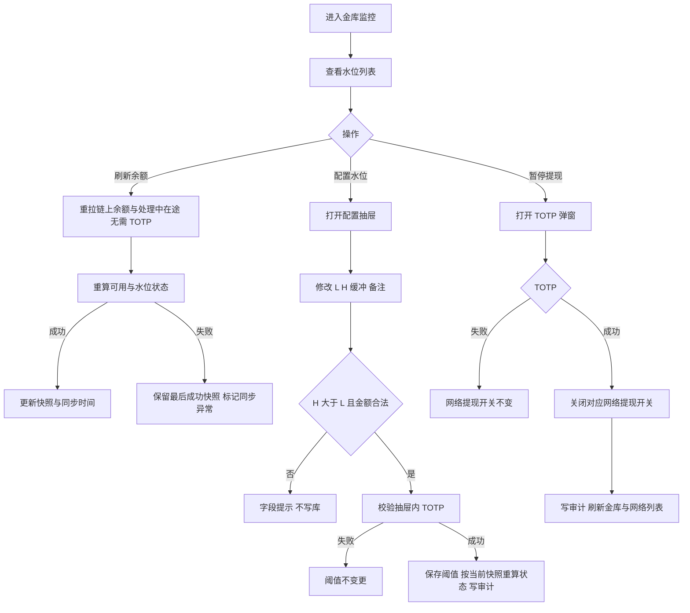

# BIYA DEX Admin 产品需求文档 V1.1.0

## 文档说明

| 项目 | 内容 |
| --- | --- |
| 文档版本 | **V1.1.0**（仅金库监控交付；2026-09-20 从范围中移除紧急控制） |
| 更新日期 | 2026-09-20 |
| 产品经理 | Terry |
| 产品名称 | BIYA DEX 管理后台 |
| 产品阶段 | S1 增量 |
| 文档定位 | 定义 V1.1.0 **唯一交付模块**：金库监控；以及水位、行内暂停该网提现、TOTP、审计与交易端的增量口径 |
| 继承 | [V1.0 PRD](https://terryxu923.github.io/biya-dex-docs/biya-dex-admin-prd.html) 第 2～6 章、通用交互、网络/资产/充提记录 **不重开、不改范围** |
| 原型 | 同目录 `BIYA-DEX-Admin原型-V1.1.0.html` |

**核心能力：** 出金热钱包水位可监控、可配置；低水位可用 TOTP 关闭该网络新提现。

**明确不做：** **紧急控制**、黑名单、提现人工审核、暂停交易、低水位自动暂停提现、金库地址/私钥管理、归集调拨、策略金库份额。

---

## 目录

- [1. 本版交付摘要](#1-本版交付摘要)
- [2. 与 V1.0 的关系](#2-与-v10-的关系)
- [3. 金库监控](#3-金库监控)
- [4. 紧急控制（暂不做）](#4-紧急控制暂不做)
- [5. 提现生效条件](#5-提现生效条件)
- [6. 角色、TOTP 与审计增量](#6-角色totp-与审计增量)
- [7. 异常与提示](#7-异常与提示)
- [8. 上线验收](#8-上线验收)
- [9. 非范围与默认假设](#9-非范围与默认假设)

---

## 1. 本版交付摘要

### 1.1 产品目标

面向资金运营与超级管理员：看清各网络出金热钱包「余额 / 在途 / 可用 / 水位」，并在低水位时用 TOTP 关掉 **该网络新提现**。不改变 V1.0 已锁定的充提主路径（无人工审核、锁定后直进处理中）。

| 目标 | 说明 |
| --- | --- |
| 水位可见 | 按网络 × 资产列出出金热钱包，识别低/高水位与同步异常 |
| 阈值可配 | 配置 L / H / 安全缓冲；地址只读 |
| 风险可停 | 低水位可手动关闭 **该网络** 提现开关 |
| 处理中不受影响 | 暂停只挡新单，不撤销、不释放已锁定处理中提现 |
| 操作可追踪 | 水位保存、行内暂停均写审计且须 TOTP |

### 1.2 本版交付能力

| 优先级 | 能力 |
| --- | --- |
| **P0** | 金库监控：列表、筛选、分页、行样式、刷新余额（无需 TOTP） |
| **P0** | 金库监控：配置水位（L / H / 缓冲 / 备注），保存须 TOTP |
| **P0** | 金库监控：低水位且该网提现仍开放时，行内「暂停提现」（TOTP 后关闭该网络提现开关） |
| **暂不做** | **紧急控制**（全站暂停提现 / 暂停交易）：侧栏可保留入口并标注「暂不做」，不提供生效中的控制操作 |
| **不做** | 低水位自动暂停提现（抽屉内标记未生效，不闭环） |
| **不做** | 黑名单、提现人工审核、导出、告警中心 |

### 1.3 核心数据模型（增量）

| 层级 | 实体 | 标识 | 核心作用 | 关系 |
| --- | --- | --- | --- | --- |
| 第一层 | 网络 | 主键 / 链 ID | V1.0 已交付；本版行内暂停写入其「提现是否开放」 | 一个网络可挂多条资产、一条出金热钱包 |
| 第二层 | 网络资产 | 主键 / 资产编码 | V1.0 已交付 | 必须归属一个网络 |
| 第三层 | 提现记录 | 提现单号 | V1.0 已交付；处理中占用计入金库「在途」 | 关联网络、资产、主账户 |
| 第三层 | 金库监控记录 | 主键 | 出金热钱包余额、在途、可用、水位 | `网络 + 资产 + 角色` 唯一；地址只读 |

### 1.4 业务边界

| 类别 | V1.1.0 |
| --- | --- |
| 管理对象 | **金库监控** |
| 资产范围 | 仍仅 USDC；数据结构可多资产，本版按 USDC 验收 |
| 金库对象 | 出金热钱包，不是公众策略金库 |
| 暂停范围 | 仅该网络 **新提现**；充值、处理中出金、查询不受影响 |
| 不在本版 | **紧急控制**、黑名单、暂停交易、自动暂停、地址/私钥、归集调拨、人工改链上余额 |

---

## 2. 与 V1.0 的关系

| V1.0 | V1.1.0 |
| --- | --- |
| 网络 / 资产 CRUD + TOTP | 不改字段与启停语义；金库行内暂停 **复用** 网络「提现是否开放」 |
| 充值 / 提现记录只读、无审核字段 | 不回流审核；「在途」取处理中占用 |
| 金库 / 紧急 / 黑名单「暂不做」 | **仅金库**去掉「暂不做」并交付写路径；**紧急控制、黑名单仍暂不做** |
| 提现生效 = 网络启用 ∧ 网络提现开 ∧ 资产启用 ∧ 资产提现开 | **保持不变**（无紧急总闸） |
| 端到端-08：侧栏打开金库/紧急/黑名单表现为暂不做 | 金库必须产生生效写操作；紧急与黑名单仍为暂不做 |

通用交互、列表规则、详情规则、页面状态、金额精度、鉴权「服务端校验、禁止只拦前端」全部沿用 V1.0 第 2、8 章。

---

## 3. 金库监控

### 3.1 用户目标

按网络监控出金金库余额、在途与可用，配置水位区间，识别低/高水位风险，必要时手动关闭该网络新提现。

### 3.2 模块说明

| 项 | 说明 |
| --- | --- |
| **触发** | 进入侧栏「金库监控」 |
| **对象** | 出金热钱包（网络 × 资产 × 角色） |
| **核心能力** | 列表、筛选、刷新余额、配置水位、低水位手动暂停提现 |
| **TOTP** | 保存水位、行内暂停提现须 TOTP；刷新余额不需要 |
| **不做** | 编辑金库地址；新增/删除金库行；公众策略金库份额；自动暂停闭环 |

### 3.3 指标口径

| 指标 | 口径 |
| --- | --- |
| 余额 | 链上余额（经确认的链上数据；禁止人工改写、禁止随机模拟作为事实） |
| 在途 | **尚未进入成功或失败终态** 的提现「实际到账金额」合计（处理中占用）。V1.0 无人工审核，**不使用**「已审核通过」口径 |
| 可用 | `max(0, 余额 − 在途 − 安全缓冲)` |
| 水位 | `[低水位 L, 高水位 H]`，须 `H > L` |
| 水位状态 | 可用 &lt; L → 低于低水位；可用 &gt; H → 高于高水位；L ≤ 可用 ≤ H → 健康 |
| 同步异常 | 刷新或定时同步失败时保留最后成功快照与时间；**不得**把过期数据标为健康 |

金额存储使用定点十进制语义；展示可用千分位；禁止二进制浮点作为事实源。

### 3.4 列表与筛选

**筛选：** 网络名称（模糊）、链 ID（精确）、资产、水位状态（全部 / 健康 / 低于低水位 / 高于高水位）

查询回第一页；重置清空条件。默认每页 10 条。

**列表字段（从左到右）：**

网络名称、链 ID、金库地址、资产、余额、在途、可用、水位、同步时间、**状态+操作**（右侧冻结）

| 展示 | 规则 |
| --- | --- |
| 金库地址 | 等宽缩略，悬停全文 |
| 余额 / 在途 / 可用 / 水位 | USDC；水位展示 `L ~ H` |
| 可用 | 低水位红色 ↓；高水位黄色 ↑；健康绿色 |
| 行背景 | 低水位浅红；高水位浅黄 |
| 状态标签 | 健康绿 / 低于低水位红 / 高于高水位黄 / 同步异常灰或红 |
| 空态 | 无匹配金库；空数据与筛选无结果文案区分 |

**行内操作**

| 操作 | 展示条件 | 行为 |
| --- | --- | --- |
| 配置水位 | 有写权限 | 打开抽屉，回填最新数据 |
| 暂停提现 | 有写权限 **且** 水位状态=低于低水位 **且** 对应网络提现开关仍开放 | 打开独立 TOTP 弹窗 |

查看员不展示写按钮。

### 3.5 配置水位（抽屉）

| 字段 | 可编辑性 |
| --- | --- |
| 所属网络、链 ID、资产、金库角色 | 只读 |
| **金库地址** | **只读，不可编辑**；提示「由部署/环境配置注入」 |
| 低水位 L、高水位 H | 可编辑，必填，非负十进制，**H > L** |
| 安全缓冲 | 可编辑，非负十进制，空视为 0 |
| 低水位自动暂停提现 | **本版不生效**：控件禁用或明确标注「未生效」，保存时不得据此关提现 |
| 备注 | 可编辑 |
| **Google 验证码（TOTP）** | **保存必填**，抽屉末节 |
| 余额、在途、可用、同步时间 | 只读快照 |

未保存关闭抽屉须确认（沿用 V1.0 表单层规则）。

### 3.6 操作与流程

| 操作 | 说明 |
| --- | --- |
| 配置水位 | 打开抽屉；**保存须 TOTP**；保存后立即按当前快照重算水位状态，不回溯历史告警 |
| 暂停提现 | 仅关闭该网络 **新提现** 入口；不撤销处理中提现；结果写入网络配置 + 审计 |
| 刷新余额 | 必须读取真实数据源；原型不得用随机数抖动余额；**无需 TOTP** |

### 3.7 业务规则

| 规则 | 要求 |
| --- | --- |
| 唯一性 | 每个「网络 + 资产 + 金库角色」仅一条有效记录 |
| 角色本版 | 仅 `出金热钱包` / `withdraw_hot` |
| 地址保护 | 后台不提供新增、编辑、删除金库和私钥操作 |
| 刷新事实 | 失败时明确「同步异常」，展示最后成功同步时间 |
| 手动暂停作用域 | **只关该网络提现开关**，不改资产提现开关 |
| 不自动恢复 | 水位回到健康后 **不** 自动打开提现；须有权限管理员在网络管理中手动开启 |

### 3.8 验收标准

| 编号 | 验收场景 | 预期结果 |
| --- | --- | --- |
| 金库-01 | 余额 100、在途 30、安全缓冲 10 | 可用金额为 60 |
| 金库-02 | 可用分别 &lt; L、= L、= H、&gt; H | 低水位、健康、健康、高水位 |
| 金库-03 | 设置高水位 ≤ 低水位 | 保存被阻断，库内阈值不变 |
| 金库-04 | 低水位行点击暂停提现并 TOTP 通过 | 对应网络提现开关关闭，客户端无法新建该网络提现 |
| 金库-05 | 余额同步失败 | 保留最后成功快照与时间，标记同步异常，不得显示为健康 |
| 金库-06 | 保存水位 TOTP 错误 | 阈值不变更 |
| 金库-07 | 暂停提现 TOTP 正确 | 同金库-04；审计含操作人、时间、前后值、TOTP 通过 |
| 金库-08 | 水位回到健康 | 已关闭的网络提现开关保持关闭 |
| 金库-09 | 查看员进入页面 | 可见列表；无配置水位/暂停/刷新写入口；直调写接口被拒 |
| 金库-10 | 金库地址输入框 | 只读；无法改地址 |

---

## 4. 紧急控制（暂不做）

> **本期范围：暂不做。** 不纳入 V1.1.0 交付与验收。

| 项 | 说明 |
| --- | --- |
| 目标（后续） | 在极端风险下快速限制充提或交易相关能力 |
| 本期要求 | 侧栏可保留入口并标注「暂不做」；页面可为占位说明，不提供生效中的控制操作 |
| 与本期关系 | 不影响网络/资产开关，以及金库行内「暂停提现」关闭该网提现开关的主路径 |
| 暂停交易 | 本版不交付，按钮禁用 |
| 全站暂停提现 | 本版不交付，按钮禁用 |

---

## 5. 提现生效条件

客户端可新建提现，当且仅当（与 V1.0 一致）：

1. 网络状态 = 启用中  
2. 网络提现开关 = 开  
3. 资产状态 = 启用中  
4. 资产提现开关 = 开  

金库行内暂停只写入第 2 条（关闭该网络提现开关）。水位恢复健康后系统不自动打开该开关。

本版 **不存在** 全站紧急总闸；交易端提现创建 **不读取** `emergency.pause_withdraw`。

---

## 6. 角色、TOTP 与审计增量

### 6.1 角色

| 角色 | 金库列表 | 刷新余额 | 配置水位 | 行内暂停提现 | 紧急控制 |
| --- | --- | --- | --- | --- | --- |
| 查看员 | 是 | 否 | 否 | 否 | 不可写（模块未交付） |
| 运营配置员 | 是 | 否 | 否 | 否 | 不可写（模块未交付） |
| 资金运营员 | 是 | 是 | 是 | 是 | 不可写（模块未交付） |
| 超级管理员 | 是 | 是 | 是 | 是 | 不可写（模块未交付） |

V1.0 四模块权限不变。绕过前端的请求同样受限。

### 6.2 TOTP 增量清单（补 V1.0 §2.6.2）

| 模块 | 操作 | 验证承载 | 是否 TOTP |
| --- | --- | --- | --- |
| 金库监控 | 保存水位 | 抽屉内嵌 | **要** |
| 金库监控 | 行内暂停提现 | 独立弹窗 | **要** |
| 金库监控 | 列表、筛选、分页、刷新余额 | — | **否** |
| 紧急控制 | 全部 | — | **否（模块未交付）** |

沿用 V1.0：业务校验通过之后、写库之前；失败不得部分写入；6 位数字；原型演示码 `111111`；生产关闭演示码；种子与验证码不落日志。

未绑定 TOTP 的管理员：写入口引导绑定，完成前不可提交。

### 6.3 审计增量（补 V1.0 §8.4）

| 操作 | 记录 |
| --- | --- |
| 保存水位 | 操作人、时间、金库标识、L/H/缓冲前后值、结果、TOTP 通过 |
| 行内暂停提现 | 操作人、时间、网络、提现开关前后值、结果、TOTP 通过 |
| TOTP 失败 | 可记安全审计（人、时间、模块、操作类型、失败）；**不得**记录验证码明文 |

审计只追加。成功写必须能证明「权限 + TOTP」均已发生。紧急控制本版无写操作，无对应审计要求。

---

## 7. 异常与提示

沿用 V1.0 第 9 章通用/表单规则，并启用金库相关异常：

| 异常 | 处理 |
| --- | --- |
| 高水位 ≤ 低水位 | 阻断保存 |
| TOTP 未满 6 位 / 错误 | 阻断，业务数据不变 |
| 链上数据源不可用 | 保留最后成功快照，标记同步异常 |
| 对应网络已关闭提现时点行内暂停 | 不展示按钮或提示「该网提现已关闭」 |
| 无写权限 | 页面无入口；接口拒绝 |
| 提交中重复点击 | 按钮加载锁定，同一请求只生效一次 |

---

## 8. 上线验收

### 8.1 本版端到端

| 编号 | 场景 | 验收结果 |
| --- | --- | --- |
| 端到端-T1 | 打开金库监控 | 无「暂不做」横幅；有权限者可刷新、配置水位 |
| 端到端-T2 | 低水位金库暂停提现 + TOTP | 该网提现关闭；交易端不可新建该网提现；处理中单继续 |
| 端到端-T3 | 侧栏打开紧急控制 | 标注或表现为「暂不做」，不产生生效中的写操作 |
| 端到端-T4 | 侧栏打开黑名单 | 仍为「暂不做」，不产生生效写操作 |
| 端到端-T5 | V1.0 网络/资产/充值/提现记录 | 行为与 V1.0 一致；提现列表仍无审核字段 |

金库-01～10、以及 V1.0 TOTP-01/02 扩展到水位保存，均为上线必过。

### 8.2 上线门槛

| 类别 | 必须满足 |
| --- | --- |
| 功能 | 本文档金库 P0 与第 8.1 场景全部通过 |
| 权限 | 表 6.1 前后端一致 |
| TOTP | 水位保存、行内暂停均服务端强制；演示码不可用于生产 |
| 资金安全 | 暂停不释放、不重复扣减处理中资金；刷新不写随机余额 |
| 数据一致性 | 金库行内暂停后，网络提现开关与客户端可用性一致 |
| 审计 | 水位保存、行内暂停可追溯到人、时间、前后值、TOTP 结果 |
| 明确不纳入门槛 | **紧急控制**、黑名单、暂停交易、自动暂停、提现人工审核 |

**失败即停：** 可编辑金库地址；刷新随机改余额；暂停撤销处理中单；仅前端拦 TOTP；紧急控制页面出现可生效写操作。

---

## 9. 非范围与默认假设

### 9.1 非范围

- **紧急控制**（全站暂停提现、暂停交易）
- 黑名单模块写操作与提现读黑名单
- 低水位自动暂停提现闭环
- 提现人工审核及审核字段回流
- 金库地址变更、私钥、归集调拨、冷热钱包调度
- 列表导出、水位告警推送、管理后台权限体系重构
- 交易终端下单 UI

### 9.2 本版默认假设（未另文覆盖前按此执行）

1. 金库地址由部署/环境配置注入，不从运营表单录入。
2. 在途 = 所有非成功/失败终态提现的实际到账金额合计（含已广播未确认）。
3. 行内暂停只关网络提现开关。
4. 紧急控制整模块不进入本版可写验收。
5. 自动暂停不进入本版可写验收。
6. S1 资产仍为 USDC。

### 9.3 开放问题（若后续改默认，须改本文与原型）

- [ ] 紧急控制是否在后续版本交付（全站暂停提现 / 暂停交易语义）
- [ ] 低水位自动暂停是否生效
- [ ] 金库地址是否与资产表「提现桥或出金合约」强制核对

---

*文档结束。V1.0 四模块规格见原 PRD，本文不重复。*
