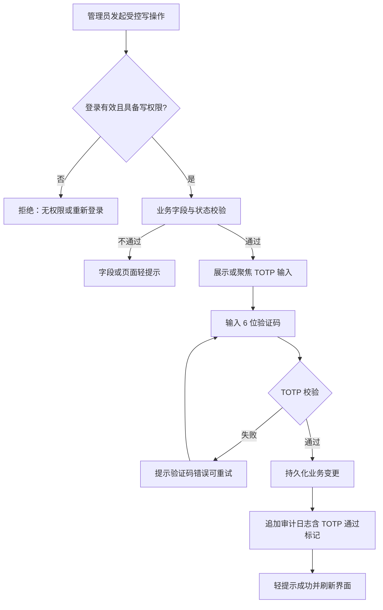
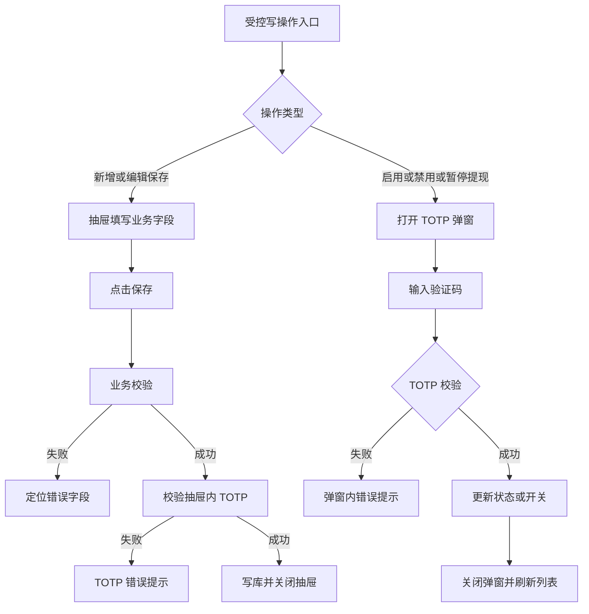
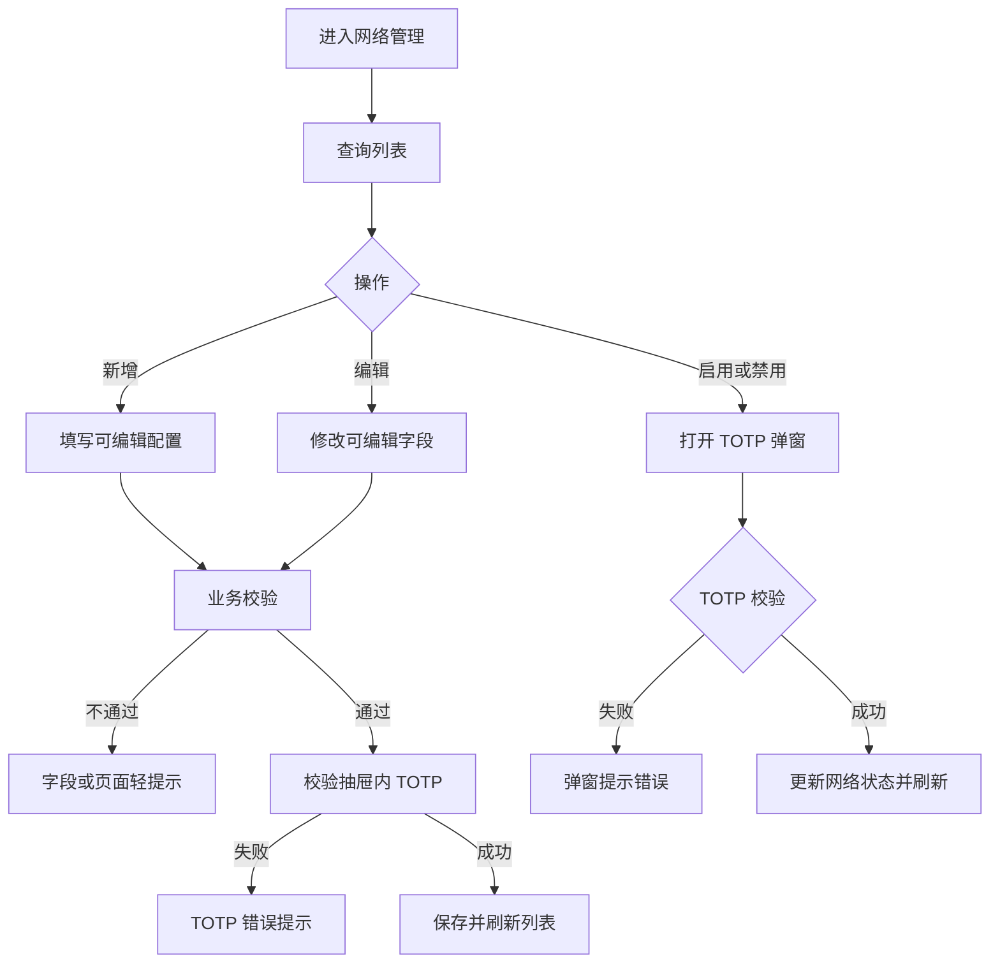
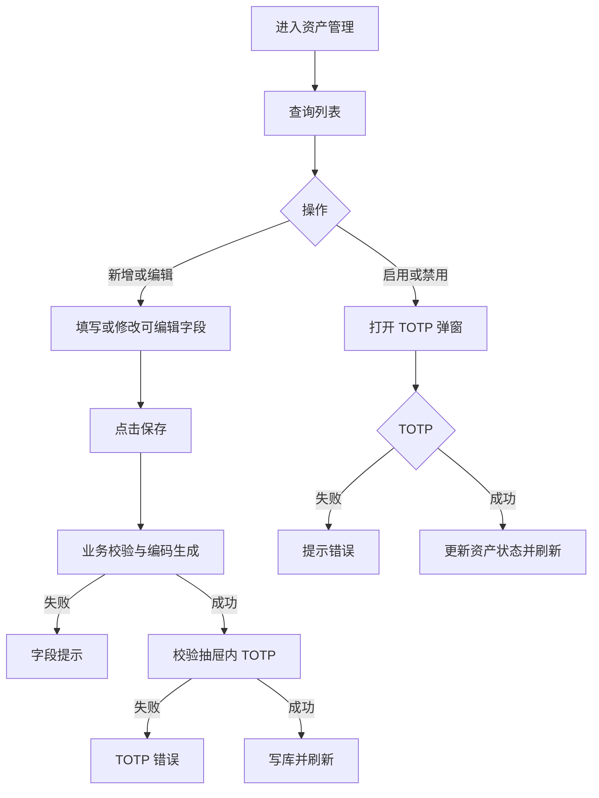
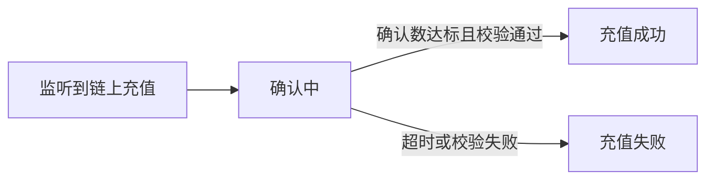
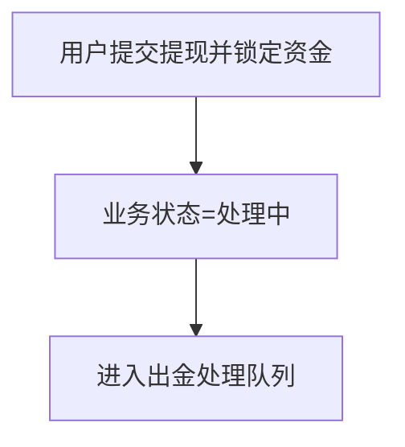
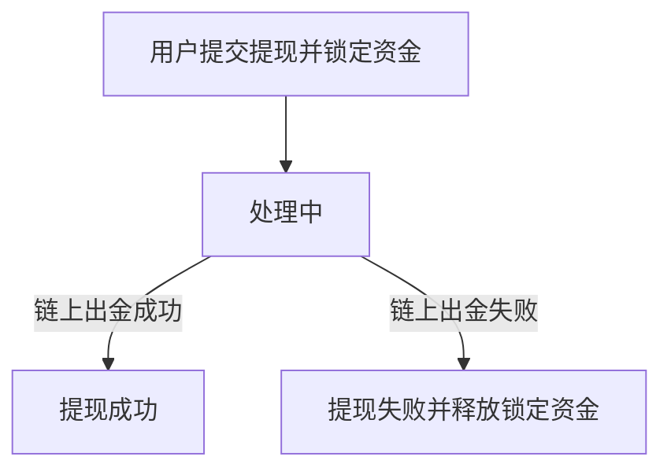
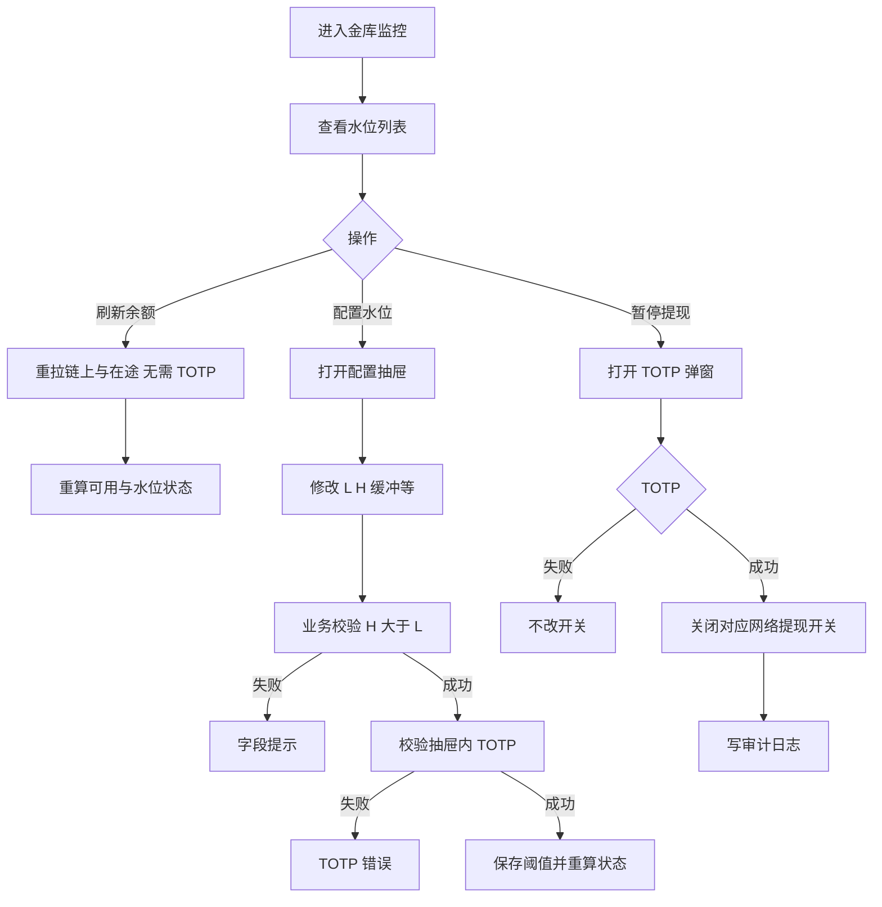

# BIYA DEX Admin 产品需求文档

## 文档说明


| 项目   | 内容                                                |
| ---- | ------------------------------------------------- |
| 文档版本 | **V1.0**（含 TOTP；2026-09-02 收敛本期范围：四模块交付，金库/紧急/黑名单与人工审核暂不做） |
| 更新日期 | 2026-09-02                                        |
| 产品经理 | Terry                                             |
| 产品名称 | BIYA DEX 管理后台                                     |
| 产品阶段 | S1                                                |
| 文档定位 | 定义永续合约运营配置与资金运营相关后台能力、列表查询、维护规则及对交易端生效口径          |
| 核心能力 | **本期交付**：网络管理 → 资产管理 → 充值记录 → 提现记录；高风险写操作须 TOTP。**暂不做**：金库监控、紧急控制、黑名单。**提现审核**：本期不支持人工审核；**不展示审核状态/审核人/审核时间/审核备注字段**。 |


---

## 目录

- [1. 本版交付摘要](#1-本版交付摘要)
- [2. 后台框架与通用规则](#2-后台框架与通用规则)
  - [2.6 TOTP 安全验证](#26-totp-安全验证)
- [3. 网络管理](#3-网络管理)
- [4. 资产管理](#4-资产管理)
- [5. 充值记录](#5-充值记录)
- [6. 提现记录](#6-提现记录)
- [7. 金库监控（暂不做）](#7-金库监控暂不做)
- [7A. 紧急控制（暂不做）](#7a-紧急控制暂不做)
- [7B. 黑名单（暂不做）](#7b-黑名单暂不做)
- [8. 横切规则](#8-横切规则)
- [9. 异常与提示](#9-异常与提示)
- [10. 上线验收](#10-上线验收)

---

## 1. 本版交付摘要

### 1.1 产品目标

BIYA DEX Admin 面向具备运营/风控权限的内部人员，用于维护交易端充提依赖的网络与资产配置，并查询充提流水。本期不做金库监控、紧急控制与黑名单；提现不做人工审核。


| 目标    | 说明                            |
| ----- | ----------------------------- |
| 配置统一  | 网络与资产分层配置，控制客户端可选充提网络与资产      |
| 资金可运营 | 充值/提现记录可查；提现无人工审核、不展示审核类字段   |
| 操作可控  | 列表筛选、新增编辑、状态启停、详情查看、确认反馈      |
| 关键可追踪 | 写操作保留创建/更新人员与时间                         |
| 暂不做   | 金库监控、紧急控制、黑名单（导航可保留入口，标注「暂不做」） |


### 1.2 核心数据模型


| 层级  | 实体     | 标识        | 核心作用                      | 关系           |
| --- | ------ | --------- | ------------------------- | ------------ |
| 第一层 | 网络     | 主键 / 链 ID | 定义链、客户端网络名称、充提开关、限额与浏览器模板 | 一个网络可挂多条资产   |
| 第二层 | 网络资产   | 主键 / 资产编码 | 定义某网络上的 USDC 等抵押资产与合约     | 必须归属一个网络     |
| 第三层 | 充值记录   | 充值单号      | 链上充值进度与入账结果               | 关联网络、资产、主账户  |
| 第三层 | 提现记录   | 提现单号      | 提现锁定、出金与终态（本期无人工审、不展示审核字段） | 关联网络、资产、主账户  |
| 第三层 | 金库监控记录 | 主键        | 出金热钱包按网络×资产的余额与水位（**暂不做**） | 关联网络与资产；地址只读 |


**生效原则：**

- 交易端网络下拉：网络状态为启用中，且对应充值/提现开关打开。
- 交易端资产可选：资产状态启用，且该资产充/提开关打开，并绑定有效网络。
- 客户端以网络名称和资产符号作为主要展示信息；链 ID、代币合约和节点连接地址仅用于系统识别与校验。


### 1.3 本版交付能力


| 优先级    | 能力                                                          |
| ------ | ----------------------------------------------------------- |
| **P0** | 网络：查询、新增、编辑、启用/禁用（**保存与启停须 TOTP**）                          |
| **P0** | 资产：查询、新增、编辑、启用/禁用；资产编码系统生成（**保存与启停须 TOTP**）                 |
| **P0** | 充值记录：多条件查询、状态列表、详情（**只读，无需 TOTP**）                          |
| **P0** | 提现记录：多条件查询、详情；**本期不提供人工审核入口；不展示审核状态/审核人/审核时间/审核备注**   |
| **P0** | TOTP 安全验证：绑定管理员、网络/资产写操作门禁、错误重试与审计                           |
| **暂不做** | 金库监控、紧急控制、黑名单                                             |
| **暂不做** | 提现人工审核（通过/拒绝）及审核弹窗内 TOTP                                   |
| **P1** | 列表导出、消息告警（不含暂不做模块内能力）                                     |


### 1.4 角色与权限


| 角色    | 能力                            |
| ----- | ----------------------------- |
| 查看员   | 本期四模块列表与详情；不展示写操作               |
| 运营配置员 | 网络、资产配置；不可改资金事实数据               |
| 资金运营员 | 查看充值/提现记录与详情（本期无人工审核操作）       |
| 超级管理员 | 拥有上述权限，用于应急处理；所有写操作均记录审计      |

> 说明：原「资金审核员」人工审核职责本期不适用；角色命名可保留，但不开放审核写权限。金库配置权限随「金库监控」一并暂不做。


### 1.5 业务边界


| 类别   | 本期范围                                       |
| ---- | ------------------------------------------ |
| 管理对象 | **网络管理、资产管理、充值记录、提现记录**                    |
| 资产范围 | S1 仅支持 USDC，数据结构保留多资产能力                    |
| **暂不做** | **金库监控、紧急控制、黑名单**；提现人工审核（通过/拒绝）           |
| 提现审核 | 本期不支持人工审核；用户提现锁定成功后业务状态直接进入「处理中」；**不展示审核状态、审核人、审核时间、审核备注**；不展示审核按钮/审核弹窗 |
| 不在本期 | 市场参数管理、清算与偿付管理、人工充值补账、人工修改链上交易结果、金库地址或私钥管理 |
| 数据原则 | 后台只配置运营参数；链上余额、确认数、交易结果等事实不允许人工改写 |


---


## 2. 后台框架与通用规则


### 2.1 模块说明


| 项        | 说明                       |
| -------- | ------------------------ |
| **用户**   | 已登录且具备模块权限的管理员           |
| **前置**   | 身份有效；后台服务可用              |
| **管理模块** | **本期**：网络管理、资产管理、充值记录、提现记录。<br>**暂不做**：金库监控、紧急控制、黑名单 |
| **权限原则** | 查看与写入分别校验                |


### 2.2 页面框架


| 区域   | 内容                         | 交互规则                       |
| ---- | -------------------------- | -------------------------- |
| 顶部栏  | 面包屑、管理员标识                  | 身份失效回登录                    |
| 侧边导航 | 运营配置 / 资金 / 风控分组           | 切换模块加载对应列表，筛选不跨模块继承        |
| 标题区  | 标题、说明、主操作                  | 主操作按写权限显示                  |
| 筛选区  | 关键词与模块条件                   | 查询回第一页；重置恢复默认              |
| 列表区  | 表格、条数、分页                   | 状态与操作列一体冻结在右侧              |
| 表单层  | 右侧抽屉新增/编辑                  | 未保存关闭可确认                   |
| 弹窗层  | 确认、**TOTP 安全验证（P0 必启）** | 同时仅一个主弹层；TOTP 可嵌于抽屉末节或独立弹窗；本期无提现审核弹窗 |


### 2.3 通用交互规则


| 场景    | 触发       | 系统行为                     | 结果                    |
| ----- | -------- | ------------------------ | --------------------- |
| 进入模块  | 点击导航     | 加载第一页                    | 列表或空态                 |
| 查询    | 条件组合     | 过滤并回第一页                  | 更新条数与列表               |
| 重置    | 点击重置     | 清空条件                     | 重新加载                  |
| 新增    | 主按钮      | 打开空白表单                   | 可填写保存                 |
| 编辑/配置 | 行内操作     | 回填最新数据                   | 按字段可编辑性展示             |
| 启用/禁用 | 行内操作     | **打开 TOTP 验证** → 通过后更新状态 | 刷新列表；TOTP 失败不改状态      |
| 详情    | 行内详情     | 打开只读详情                   | 字段名与值颜色区分；**无需 TOTP** |
| 提交中   | 保存处理中 | 锁定按钮                     | 不重复提交；TOTP 未通过不得进入提交  |


**列表通用规则**


| 项     | 规则                           |
| ----- | ---------------------------- |
| 分页    | 默认每页 10 条；翻页保留筛选条件           |
| 时间    | `YYYY-MM-DD HH:mm:ss`        |
| 地址/哈希 | 等宽缩略，悬停可看全文                  |
| 金额    | 十进制字符串语义；展示可读格式              |
| 状态    | 标签文案明确，不只靠颜色                 |
| 右侧冻结  | **状态 + 操作合并为一列**，横向滚动时整体钉在右侧 |
| 列顺序   | 高频运营字段靠左，低频字段靠右              |


### 2.4 详情展示规则


| 项     | 规则            |
| ----- | ------------- |
| 字段名称  | 次要色（灰）        |
| 字段值   | 主文本色（深）       |
| 空值    | 展示 `—`，使用更弱颜色 |
| 地址/哈希 | 等宽样式          |


### 2.5 全局页面状态


| 状态        | 触发     | 展示           | 可操作      |
| --------- | ------ | ------------ | -------- |
| 加载中       | 进入或刷新  | 占位           | 不操作未加载行  |
| 正常        | 成功     | 筛选+列表        | 按权限操作    |
| 空数据       | 无记录    | 空态           | 可新增（有权限） |
| 筛选无结果     | 有数据无匹配 | 无匹配提示        | 可重置      |
| 加载失败      | 请求失败   | 错误+重试        | 重试       |
| 提交中/成功/失败 | 写操作    | 锁定按钮或展示页面轻提示 | 失败可改后重试  |


### 2.6 TOTP 安全验证


#### 2.6.1 目标与原则


| 项     | 说明                                                            |
| ----- | ------------------------------------------------------------- |
| 目标    | 对会改变线上充提路由的后台写操作（网络/资产配置与启停），增加与登录态独立的第二因子（TOTP）。金库与提现人工审核相关 TOTP 随对应能力暂不做 |
| 绑定    | 管理员账号须完成 Google Authenticator（或兼容应用）绑定后方可执行受控写操作；未绑定则写入口引导去绑定 |
| 校验时机  | **业务字段校验通过之后、持久化写库之前**；TOTP 失败不得产生部分写入                        |
| 原型约定  | 联调/原型环境可使用固定演示码 `111111`；生产环境必须校验真实动态 6 位码，演示码关闭              |
| 不对客   | TOTP 仅后台；交易端用户无此流程                                            |
| 与登录关系 | TOTP 不替代登录与 RBAC；须同时满足：登录有效 ∧ 模块写权限 ∧ TOTP 通过                 |


#### 2.6.2 需要 TOTP 的操作清单（P0）


| 模块   | 操作       | 验证承载        | 是否 TOTP | 说明                      |
| ---- | -------- | ----------- | ------- | ----------------------- |
| 网络管理 | 新增保存     | 抽屉内 TOTP 分区 | **要**   | 写入网络配置                  |
| 网络管理 | 编辑保存     | 抽屉内 TOTP 分区 | **要**   | 变更开关/限额/模板等             |
| 网络管理 | 启用       | 独立 TOTP 弹窗  | **要**   | 恢复客户端可选                 |
| 网络管理 | 禁用       | 独立 TOTP 弹窗  | **要**   | 下线路由                    |
| 资产管理 | 新增保存     | 抽屉内 TOTP 分区 | **要**   | 写入资产与合约                 |
| 资产管理 | 编辑保存     | 抽屉内 TOTP 分区 | **要**   | 变更开关/Logo 等             |
| 资产管理 | 启用       | 独立 TOTP 弹窗  | **要**   | —                       |
| 资产管理 | 禁用       | 独立 TOTP 弹窗  | **要**   | —                       |

> **本期不做 TOTP 的能力（随模块暂不做）：** 提现人工审核通过/拒绝；金库水位保存；金库暂停提现；紧急控制与黑名单相关写操作。


#### 2.6.3 不需要 TOTP 的操作


| 模块   | 操作                | 原因                               |
| ---- | ----------------- | -------------------------------- |
| 各模块  | 进入列表、筛选、分页、排序     | 只读查询                             |
| 充值记录 | 详情                | 只读；本版无改账                         |
| 提现记录 | 详情、列表查询           | 只读；本期无人工审核写操作                    |
| 金库监控等 | 全部（暂不做）           | 模块未交付，不纳入本期 TOTP 验收              |
| 全局   | 重置筛选、关闭抽屉/弹窗（未提交） | 无写库                              |


#### 2.6.4 交互形态


| 形态         | 适用              | 交互要点                          |
| ---------- | --------------- | ----------------------------- |
| 抽屉内嵌 TOTP  | 新增/编辑网络、资产 | 表单末节「安全验证（TOTP）」；6 位数字；点保存时校验 |
| 独立 TOTP 弹窗 | 启用/禁用网络或资产 | 标题标明操作类型与对象名称；通过后执行业务写        |

> 原「提现审核弹窗内嵌 TOTP」「金库配置水位 / 暂停提现 TOTP」随对应能力暂不做，本期原型与验收不覆盖。


**字段与校验**


| 项       | 规则                                     |
| ------- | -------------------------------------- |
| 输入      | 仅数字，长度 6；支持粘贴后自动截断                     |
| 未满 6 位  | 阻断，提示「请输入完整的 6 位验证码」                   |
| 错误      | 阻断，提示验证码错误；**不**泄露服务器侧剩余尝试策略细节给无权限方    |
| 成功      | 清除输入框；执行原写操作；页面轻提示业务成功文案               |
| 打开表单/弹窗 | 清空上次 TOTP 输入与错误态                       |
| 并发      | 同一管理员短时间多次失败可触发冷却（实现可选，P1 可强制）；冷却中禁止提交 |


#### 2.6.5 通用 TOTP 流程图




#### 2.6.6 抽屉保存与列表启停分叉




#### 2.6.7 验收标准（TOTP 横切）


| 编号      | 验收场景                  | 预期结果                             |
| ------- | --------------------- | -------------------------------- |
| TOTP-01 | 未填或不足 6 位点击网络/资产/水位保存 | 不写库，提示完整 6 位                     |
| TOTP-02 | 错误验证码提交               | 不写库，状态与数据不变                      |
| TOTP-03 | 正确验证码保存网络或资产          | 写库成功，审计含操作人时间与 TOTP 通过           |
| TOTP-04 | 列表禁用网络输入正确 TOTP       | 状态变为已禁用，客户端不可选                   |
| TOTP-05 | 充值详情、列表查询、提现详情     | 全程无 TOTP 输入                      |
| TOTP-06 | 尝试打开提现审核入口（若残留）   | 无可用审核入口；或入口不可用且不改变任何提现单状态     |
| TOTP-08 | 查看员角色                 | 无写入口；直调写接口被拒且不要求/不绕过 TOTP        |


---


## 3. 网络管理


### 3.1 用户目标

维护充提可用区块链网络，控制客户端可见网络名称、充提开关、限额费用与浏览器跳转模板。

### 3.2 模块说明


| 项        | 说明                               |
| -------- | -------------------------------- |
| **触发**   | 进入「网络管理」                         |
| **核心能力** | 查询、新增、编辑、启用、禁用                   |
| **关键约束** | 链 ID 唯一；部分技术字段只读；**保存与启停须 TOTP** |
| **前台影响** | 充提网络下拉、切链提示文案、最小充提与手续费展示         |


### 3.3 流程步骤




| 步骤  | 管理员操作   | 系统行为                    | 结果                 |
| --- | ------- | ----------------------- | ------------------ |
| 1   | 进入模块    | 加载列表                    | 展示数据               |
| 2   | 筛选查询    | 组合过滤                    | 更新列表               |
| 3   | 新增/编辑网络 | 打开表单；只读项填系统默认；末节展示 TOTP | 可编辑项可改             |
| 4   | 保存      | 业务校验 → **TOTP 校验** → 写库 | 写入成功或报错；TOTP 失败不写库 |
| 5   | 启用/禁用   | **TOTP 弹窗**通过后改状态       | 客户端路由随状态变化         |


### 3.4 列表与筛选

**筛选**


| 条件     | 规则                   |
| ------ | -------------------- |
| 网络名称   | 模糊                   |
| 链 ID   | 精确                   |
| 网络状态   | 全部 / 启用中 / 维护中 / 已禁用 |
| 充值是否开放 | 全部 / 开放 / 关闭         |
| 提现是否开放 | 全部 / 开放 / 关闭         |


**列表字段（左→右，状态操作在右冻结列）**

网络名称、链 ID、充值、提现、充值确认数、最低充值、最低提现、提现手续费、预计充值(分)、预计提现(分)、提现观察确认数、网络图标、交易浏览器、地址浏览器、更新时间、更新人员、**状态+操作**

### 3.5 新增与编辑


| 分组       | 字段                        | 可编辑性                      |
| -------- | ------------------------- | ------------------------- |
| 基础标识     | 网络名称、网络图标                 | 新增和编辑时可修改                 |
| 基础标识     | 链 ID                      | 新增时必填；创建成功后只读，配错时禁用旧网络并新建 |
| 开关与状态    | 网络状态、充值是否开放、提现是否开放        | 可编辑                       |
| 确认数与预计时效 | 充值确认数、提现观察确认数             | **只读**（系统/部署写入）           |
| 确认数与预计时效 | 预计充值到账时间（分钟）、预计提现到账时间（分钟） | **可配置**                   |
| 限额与手续费   | 最低充值、最低提现、提现手续费           | 可编辑                       |
| 浏览器链接    | 交易浏览器模板、地址浏览器模板           | 可编辑；交易模板须含 `{txHash}`     |
| 备注       | 备注                        | 可编辑                       |
| **安全验证** | **Google 验证码（TOTP）**      | **保存必填**；6 位数字            |
| 审计       | 创建/更新时间与人员                | 只读展示于列表                   |


**不提供：** 节点连接地址配置（由部署与运维通道管理，不在本表维护）。

**校验**


| 项       | 规则                     |
| ------- | ---------------------- |
| 网络名称    | 必填                     |
| 链 ID    | 必填，仅允许正整数，全局唯一；创建后不可修改 |
| 预计到账分钟  | 必填，非负整数                |
| 金额字段    | 非负十进制                  |
| 交易浏览器模板 | 必含 `{txHash}`          |
| 地址浏览器模板 | 若填写须含 `{address}`      |
| TOTP    | 必填 6 位；错误则整单不保存        |


### 3.6 状态


| 状态  | 含义         | 客户端                    |
| --- | ---------- | ---------------------- |
| 启用中 | 网络可参与充提路由  | 对应充值或提现开关打开时可选         |
| 维护中 | 网络临时不接受新充提 | 可展示“维护中”但不可选；已在途记录继续处理 |
| 已禁用 | 网络长期停用     | 不展示；历史记录仍可查            |


### 3.7 交互规则


| 规则   | 说明                                               |
| ---- | ------------------------------------------------ |
| 启停安全 | **启用/禁用必须 TOTP 通过**（可用弹窗文案说明后果，不再以无 TOTP 的弱确认代替） |
| 只读字段 | 样式区分，不可聚焦修改                                      |
| 保存成功 | TOTP 通过后：页面轻提示 + 关闭抽屉 + 刷新列表                     |
| 关闭充值 | 禁止生成新充值指引；不停止已发生链上交易的监听与入账                       |
| 关闭提现 | 禁止新建提现；已进入处理中或之后的提现不因开关变更被自动取消                    |


### 3.8 数据管理


| 字段        | 说明     |
| --------- | ------ |
| 主键        | 内部 ID  |
| 网络名称      | 客户端显示名 |
| 链 ID      | 钱包与校验  |
| 充值/提现开放   | 布尔     |
| 网络状态      | 枚举     |
| 确认数       | 系统只读   |
| 预计充/提分钟   | 运营配置   |
| 最低充/提、手续费 | USDC   |
| 浏览器模板     | 跳转     |
| 图标、备注     | 可选     |
| 创建/更新人时   | 审计     |


### 3.9 验收标准


| 编号    | 验收场景               | 预期结果                  |
| ----- | ------------------ | --------------------- |
| 网络-01 | 使用重复链 ID 新增网络      | 保存被阻断，明确提示链 ID 已存在    |
| 网络-02 | 编辑已创建网络            | 链 ID、充值确认数、提现观察确认数为只读 |
| 网络-03 | 关闭提现开关             | 新提现不再可选该网络，已处理记录状态不变  |
| 网络-04 | 将网络改为维护中           | 客户端不得发起新充提，历史记录可继续查询  |
| 网络-05 | 提交不包含占位符的浏览器模板     | 保存被阻断并定位到错误字段         |
| 网络-06 | 业务字段合法但 TOTP 错误或未填 | 不写库，网络数据不变            |
| 网络-07 | 禁用网络时 TOTP 正确      | 状态为已禁用，客户端不可选该网发起新充提  |


---


## 4. 资产管理


### 4.1 用户目标

维护各网络上的抵押资产（S1 为 USDC），绑定代币合约，控制资产级充提开关。

### 4.2 模块说明


| 项        | 说明                                       |
| -------- | ---------------------------------------- |
| **触发**   | 进入「资产管理」                                 |
| **核心能力** | 查询、新增、编辑、启用、禁用                           |
| **关键约束** | 必须选择所属网络；资产编码系统生成；同网合约唯一；**保存与启停须 TOTP** |
| **前台影响** | 充提资产与合约校验                                |


### 4.3 流程步骤




| 步骤  | 管理员操作 | 系统行为                      | 结果     |
| --- | ----- | ------------------------- | ------ |
| 1   | 进入模块  | 加载资产列表                    | 展示     |
| 2   | 筛选    | 按网络/编码/符号/状态/开关/合约过滤      | 更新列表   |
| 3   | 新增    | 选网络、填符号与合约等；末节 TOTP       | 预览资产编码 |
| 4   | 保存    | 生成编码、校验合约 → **TOTP** → 写库 | 写入或报错  |
| 5   | 启用/禁用 | **TOTP 弹窗**通过后改状态         | 刷新列表   |


### 4.4 列表与筛选

**筛选：** 所属网络、资产编码、链上符号、状态、充值开放、提现开放、代币合约（模糊）

**列表字段（左→右）：**  
资产编码、链上符号、所属网络、充值、提现、代币精度、代币合约、充值桥、提现桥、资产 Logo、备注、主键、创建时间、创建人员、更新时间、更新人员、**状态+操作**

### 4.5 新增与编辑


| 字段                   | 可编辑性                       |
| -------------------- | -------------------------- |
| 所属网络                 | 新增必选；创建后只读                 |
| 链上符号                 | 新增必填；创建后只读                 |
| 资产编码                 | **系统自动生成，只读**              |
| 代币精度                 | 新增必填，取值 0～36；创建后只读         |
| 资产 Logo              | 可编辑                        |
| 代币合约地址               | 新增必填，`0x` + 40 位十六进制；创建后只读 |
| 充值桥或网关合约             | **只读**（部署注入）               |
| 提现桥或出金合约             | **只读**（部署注入）               |
| 状态、充/提开关             | 可编辑                        |
| 备注                   | 可编辑                        |
| **Google 验证码（TOTP）** | **保存必填**                   |


**资产编码规则**


| 项   | 规则                          |
| --- | --------------------------- |
| 格式  | `{链上符号}_{链ID}`，符号规范化为大写字母数字 |
| 唯一性 | 同一网络下链上符号唯一；重复时阻断保存，不自动追加后缀 |
| 编辑  | 编码创建后不变                     |


### 4.6 状态与交互


| 状态  | 客户端      |
| --- | -------- |
| 启用中 | 开关打开时可充提 |
| 已禁用 | 不可用      |


| 规则      | 说明                       |
| ------- | ------------------------ |
| 同网同资产编码 | 生成逻辑保证不冲突                |
| 同网同合约   | 阻断重复                     |
| 上层网络不可用 | 资产即使自身启用也不可在客户端充提        |
| 关闭资产充值  | 仅禁止该网络资产的新充值指引，已发生充值继续监听 |
| 关闭资产提现  | 仅禁止新提现，不中断已处理记录          |


### 4.7 数据管理


| 字段         | 说明    |
| ---------- | ----- |
| 主键         | 记录 ID |
| 所属网络       | 外键    |
| 资产编码       | 系统生成  |
| 链上符号、精度、合约 | 链上实例  |
| 桥合约        | 只读    |
| 充/提开放、状态   | 运营    |
| Logo、备注、审计 | 展示与追踪 |


### 4.8 验收标准


| 编号    | 验收场景                 | 预期结果                      |
| ----- | -------------------- | ------------------------- |
| 资产-01 | 选择网络并输入 USDC         | 系统预览并保存为 `USDC_链ID`       |
| 资产-02 | 同网络重复新增同符号或同合约资产     | 保存被阻断，不自动生成带后缀的资产编码       |
| 资产-03 | 编辑已创建资产              | 所属网络、链上符号、资产编码、精度和合约地址为只读 |
| 资产-04 | 上层网络禁用，资产仍启用         | 客户端不展示该网络资产为可充提           |
| 资产-05 | 输入非法合约地址或 0～36 之外的精度 | 保存被阻断并给出字段级提示             |
| 资产-06 | TOTP 错误时保存           | 不写库                       |
| 资产-07 | 启停资产 TOTP 正确         | 状态变更成功并写审计                |


---


## 5. 充值记录


### 5.1 用户目标

查询用户充值进度与结果，支持按状态与关键字段排查。

### 5.2 模块说明


| 项        | 说明            |
| -------- | ------------- |
| **触发**   | 进入「充值记录」      |
| **核心能力** | 列表查询、详情       |
| **无**    | 人工改账（本版）      |
| **TOTP** | **不需要**（只读模块） |


### 5.3 列表与筛选


| 筛选项  | 匹配规则                               |
| ---- | ---------------------------------- |
| 网络名称 | 模糊匹配                               |
| 充值资产 | 模糊匹配                               |
| 充值状态 | 全部 / 确认中 / 充值成功 / 充值失败             |
| 主账户  | 匹配账户 ID、账户标识或钱包地址片段                |
| 交易哈希 | 模糊匹配，忽略字母大小写                       |
| 异常类型 | 全部 / 无 / 确认超时 / 金额不匹配 / 无效备注 / 链重组 |


**列表字段（左→右）：**  
网络名称、充值资产、充值金额、确认入账金额、当前确认数/所需确认数、主账户、钱包地址、发送地址、接收地址、交易哈希、提交时间、入账时间、失败原因、异常类型、备注、创建时间、更新时间、**状态+操作**

**充值金额展示**


| 状态       | 充值金额列含义 |
| -------- | ------- |
| 充值成功     | 入账额     |
| 确认中 / 失败 | 请求额     |


### 5.4 状态


| 状态   | 说明       |
| ---- | -------- |
| 确认中  | 未达确认或处理中 |
| 充值成功 | 已入账      |
| 充值失败 | 终态失败     |


**异常类型：** 无、确认超时、金额不匹配、无效备注、链重组。异常类型用于排查，不替代充值状态。

### 5.5 详情

详情抽屉只读展示列表全部字段，并补充充值单号、链 ID、资产编码、交易日志序号等唯一追踪字段。名称与值颜色区分；地址和交易哈希可复制，已配置浏览器模板时可跳转链上浏览器。

### 5.6 操作


| 操作  | 说明     |
| --- | ------ |
| 详情  | 打开详情抽屉 |


### 5.7 业务规则




| 规则    | 要求                                          |
| ----- | ------------------------------------------- |
| 唯一识别  | 使用“链 ID + 交易哈希 + 交易日志序号”识别链上入金事件，同一事件不得重复入账 |
| 确认数   | 所需确认数取创建记录时的网络配置快照；后续修改网络配置不回溯改写历史记录        |
| 入账原子性 | 账户余额增加、确认入账金额写入和状态转为充值成功必须作为一个不可拆分的业务结果     |
| 终态保护  | 充值成功和充值失败为终态，后台不提供人工改状态或改金额入口               |
| 链重组   | 标记异常并触发事件处理；不允许运营员在记录页直接扣减用户余额              |
| 默认排序  | 按提交时间倒序，最新记录在前                              |


### 5.8 验收标准


| 编号    | 验收场景               | 预期结果                      |
| ----- | ------------------ | ------------------------- |
| 充值-01 | 按账户 ID、地址片段或交易哈希查询 | 返回匹配记录并回到第 1 页            |
| 充值-02 | 当前确认数未达所需确认数       | 状态为确认中，确认入账金额和入账时间为空      |
| 充值-03 | 链上事件被重复消费          | 仅保留一条充值记录，用户余额仅增加一次       |
| 充值-04 | 打开充值详情             | 展示全量字段，空值为 `—`，地址与交易哈希可复制 |
| 充值-05 | 尝试从后台修改充值状态或金额     | 页面不提供相关操作，接口也不接受此类修改      |


---


## 6. 提现记录


### 6.1 用户目标

查询提现单进度与结果。本期**不支持人工审核**，后台**不展示审核状态、审核人、审核时间、审核备注**；用户提现锁定成功后业务状态直接进入「处理中」。


### 6.2 模块说明


| 项        | 说明                                                         |
| -------- | ---------------------------------------------------------- |
| **触发**   | 进入「提现记录」                                                   |
| **核心能力** | 列表查询、详情（只读）                                                |
| **审核**   | **本期不支持人工审核**；**不展示审核相关字段与操作**；不提供审核弹窗                  |
| **TOTP** | 本期提现模块无写操作，无需 TOTP                                        |


### 6.3 列表与筛选


| 筛选项  | 匹配规则                              |
| ---- | --------------------------------- |
| 网络名称 | 模糊匹配                              |
| 提现资产 | 模糊匹配                              |
| 状态   | 全部 / 处理中 / 提现成功 / 提现失败 / 已拒绝（兼容） |
| 主账户  | 匹配账户 ID 或账户标识片段                   |
| 目标地址 | 模糊匹配，忽略字母大小写                      |
| 交易哈希 | 模糊匹配，未广播记录的交易哈希为空                 |


**列表字段（左→右）：**  
网络名称、提现资产、主账户、目标地址、总扣减金额、实际到账金额、提现手续费、交易哈希、失败原因、创建时间、锁定时间、完成时间、备注、**状态+操作**

> 操作列本期仅「详情」。不展示「审核」。不展示审核状态/审核人/审核时间/审核备注。


### 6.4 状态


| 业务状态 | 说明                         |
| ---- | -------------------------- |
| 处理中  | 锁定成功后进入出金处理                |
| 提现成功 | 终态成功                       |
| 提现失败 | 出金失败                       |
| 已拒绝  | 兼容历史数据；**本期主路径不产生**        |
| 待审核  | 兼容历史数据；**本期主路径不停留此状态**     |


**本期主路径**


| 业务状态 | 资金处理             | 是否终态 |
| ---- | ---------------- | ---- |
| 处理中  | 已进入出金队列或链上确认中    | 否    |
| 提现成功 | 锁定金额已最终扣减        | 是    |
| 提现失败 | 未成功出金的锁定金额已释放回账户 | 是    |


### 6.5 审核策略（本期）




| 规则     | 说明                                         |
| ------ | ------------------------------------------ |
| 无人工入口  | 列表/详情不展示「审核」；不提供审核弹窗；接口不接受人工通过/拒绝（若残留须拒绝） |
| 无审核字段  | 后台列表、详情、筛选均不展示审核状态、审核人、审核时间、审核备注           |
| 主路径    | 锁定总扣减金额成功后，业务状态为「处理中」并进入出金队列               |
| 后续扩展预留 | 若恢复人工审核，须另行评审字段、流程、TOTP 与权限                 |


### 6.6 详情与操作

详情抽屉只读展示提现单号、网络、资产、主账户、目标地址、金额、业务状态、交易哈希、失败原因及各阶段时间。目标地址和交易哈希可复制，已配置浏览器模板时可跳转链上浏览器。**不展示审核类字段。**


| 操作  | 说明                 |
| --- | ------------------ |
| 详情  | 只读全字段（不含审核类字段）     |
| 审核  | **本期不做**；不展示该操作入口 |


### 6.7 业务规则




| 规则   | 要求                                 |
| ---- | ---------------------------------- |
| 金额恒等 | 总扣减金额 = 实际到账金额 + 提现手续费；全部金额使用申请时快照 |
| 锁定优先 | 只有成功锁定总扣减金额后才能生成提现记录并进入处理中         |
| 入队   | 锁定成功即送入出金处理队列；交易哈希必须在真实链上交易广播成功后写入 |
| 处理失败 | 记录链上或系统失败原因，并仅释放一次未完成出金的锁定资金       |
| 幂等   | 同一提现单不得重复入队或重复释放资金                 |
| 默认排序 | 按创建时间倒序，最新记录在前                     |


### 6.8 验收标准


| 编号    | 验收场景            | 预期结果                            |
| ----- | --------------- | ------------------------------- |
| 提现-01 | 用户成功提交提现并锁定     | 业务状态为处理中；无人工审核步骤                |
| 提现-02 | 打开提现列表/详情       | **无审核状态/审核人/审核时间/审核备注**；无「审核」按钮 |
| 提现-03 | 链上出金成功          | 业务状态提现成功；交易哈希在广播后出现；金额恒等成立      |
| 提现-04 | 出金失败            | 业务状态提现失败；锁定金额仅释放一次              |
| 提现-05 | 查看员或运营配置员打开提现记录 | 可查看详情；不展示审核操作与审核字段              |
| 提现-06 | 调用残留人工审核接口（若有）  | 请求被拒绝，提现单状态不变                   |


---


## 7. 金库监控（暂不做）

> **本期范围：暂不做。** 本章保留需求草案供后续启用，不纳入本期 P0 交付、联调与上线验收。导航若保留入口，须标注「暂不做」，且不提供可写操作。


### 7.1 用户目标

按网络监控出金金库余额、在途与可用，配置水位区间，识别低/高水位风险。

### 7.2 模块说明


| 项        | 说明                          |
| -------- | --------------------------- |
| **触发**   | 进入「金库监控」                    |
| **对象**   | 出金热钱包（网络 × 资产）              |
| **核心能力** | 列表、筛选、刷新余额、配置水位             |
| **TOTP** | **保存水位、暂停提现须 TOTP**；刷新余额不需要 |
| **不做**   | 编辑金库地址；公众策略金库份额             |


### 7.3 指标口径


| 指标   | 口径                                            |
| ---- | --------------------------------------------- |
| 余额   | 链上余额                                          |
| 在途   | 已审核通过、尚未进入成功或失败终态的提现实际到账金额合计                  |
| 可用   | 取 0 与“余额 − 在途 − 安全缓冲”中的较大值                    |
| 水位   | [低水位 L, 高水位 H]                                |
| 水位状态 | 可用 < L → 低于低水位；可用 > H → 高于高水位；L ≤ 可用 ≤ H → 健康 |


### 7.4 列表与筛选

**筛选：** 网络名称、链 ID、资产、水位状态

**列表字段：**  
网络名称、链 ID、金库地址、资产、余额、在途、可用、水位、同步时间、**状态+操作**

**行样式：** 低水位浅红、高水位浅黄；可用金额低/高用箭头与颜色强调。

### 7.5 配置水位（编辑）


| 字段                   | 可编辑性                     |
| -------------------- | ------------------------ |
| 所属网络、链 ID、资产、金库角色    | 只读                       |
| **金库地址**             | **只读，不可编辑**              |
| 低水位 L、高水位 H          | 可编辑，H > L                |
| 安全缓冲                 | 可编辑                      |
| 低水位自动暂停提现            | P1 可编辑；P1 上线前不展示或明确标记未生效 |
| 备注                   | 可编辑                      |
| **Google 验证码（TOTP）** | **保存必填**                 |
| 余额、在途、可用、同步时间        | 只读快照                     |


### 7.6 操作与流程




| 操作   | 说明                                       |
| ---- | ---------------------------------------- |
| 配置水位 | 打开配置抽屉；**保存须 TOTP**                      |
| 暂停提现 | 低水位且对应网络提现尚开放时展示；**TOTP 通过后**关闭对应网络的提现开关 |
| 刷新余额 | 重新获取链上余额和提现在途数据，重算可用金额与水位；**无需 TOTP**    |


### 7.7 状态


| 水位状态  | 标签                               |
| ----- | -------------------------------- |
| 健康    | 绿色                               |
| 低于低水位 | 红色                               |
| 高于高水位 | 黄色                               |
| 同步异常  | 灰色或红色异常标签，展示最后成功同步时间，不将过期数据标记为健康 |


### 7.8 业务规则


| 规则    | 要求                                       |
| ----- | ---------------------------------------- |
| 唯一性   | 每个“网络 + 资产 + 金库角色”仅对应一条有效金库监控记录          |
| 地址保护  | 金库地址由部署或环境配置注入，后台仅可查看，不提供新增、编辑、删除和私钥操作   |
| 刷新事实  | 手动刷新必须读取真实数据源，不得生成随机余额或人工改写链上余额          |
| 手动暂停  | 仅关闭新提现入口，不撤销已审核或处理中提现；操作结果须同时写入网络配置和审计日志 |
| 不自动恢复 | 水位恢复健康后不自动开启提现，须由有权限管理员复核并手动开启           |
| 配置生效  | 保存新水位后立即按当前快照重算状态，但不回溯改写历史告警             |


### 7.9 验收标准


| 编号    | 验收场景                      | 预期结果                      |
| ----- | ------------------------- | ------------------------- |
| 金库-01 | 余额 100、在途 30、安全缓冲 10      | 可用金额为 60                  |
| 金库-02 | 可用金额分别小于 L、等于 L、等于 H、大于 H | 依次显示低水位、健康、健康、高水位         |
| 金库-03 | 设置高水位小于或等于低水位             | 保存被阻断                     |
| 金库-04 | 在低水位行点击暂停提现并确认            | 对应网络提现开关真实关闭，客户端无法新建该网络提现 |
| 金库-05 | 余额同步失败                    | 保留最后成功快照与时间，明确标记同步异常      |
| 金库-06 | 保存水位时 TOTP 错误             | 阈值不变更                     |
| 金库-07 | 暂停提现 TOTP 正确              | 网络提现开关关闭，客户端无法新建该网提现      |


---


## 7A. 紧急控制（暂不做）

> **本期范围：暂不做。** 不纳入本期交付与验收。

| 项 | 说明 |
| --- | --- |
| 目标（后续） | 在极端风险下快速限制充提或交易相关能力 |
| 本期要求 | 侧栏可保留入口并标注「暂不做」；页面可为占位说明，不提供生效中的控制操作 |
| 与本期关系 | 不影响网络/资产开关与提现锁定后直进处理中的主路径 |


## 7B. 黑名单（暂不做）

> **本期范围：暂不做。** 不纳入本期交付与验收。

| 项 | 说明 |
| --- | --- |
| 目标（后续） | 限制特定用户/地址的提现等资金操作 |
| 本期要求 | 侧栏可保留入口并标注「暂不做」；不提供添加/编辑/生效黑名单能力 |
| 与本期关系 | 本期提现仅依赖网络/资产开关，不读取黑名单 |


## 8. 横切规则


### 8.1 实体关系

```
网络 1 ── n 资产
网络 1 ── n 充值记录 / 提现记录
网络 × 资产 ── 金库监控行（出金热钱包）
提现处理中 ── 汇总计入对应金库「在途」
```


### 8.2 状态联动


| 变化           | 影响                      |
| ------------ | ----------------------- |
| 网络禁用/维护      | 客户端不可选；已有流水仍可查          |
| 网络关闭提现       | 新提现不可选该网                |
| 资产禁用         | 该网该资产不可充提               |
| 金库低水位且手动暂停   | 关闭该网络提现开关，并保留操作审计       |
| 金库低水位且开启自动暂停 | P1 上线后自动关闭该网络提现开关，不自动恢复 |


**最终生效条件**


| 能力  | 客户端可用条件                                   |
| --- | ----------------------------------------- |
| 充值  | 网络状态为启用中 且 网络充值开关打开 且 资产状态为启用中 且 资产充值开关打开 |
| 提现  | 网络状态为启用中 且 网络提现开关打开 且 资产状态为启用中 且 资产提现开关打开 |


### 8.3 前台生效


| 配置              | 交易端                    |
| --------------- | ---------------------- |
| 网络名称            | 充提下拉与提示                |
| 预计到账分钟          | 展示预估（若产品展示）            |
| 最低充提/手续费        | 表单校验与摘要                |
| 资产编码            | 内部；用户见符号 USDC          |
| 链 ID / 代币合约     | 用于系统识别和校验，不作为客户端主要展示信息 |
| 充值接收地址 / 提现目标地址 | 在对应充提流程中完整展示并支持复制      |


### 8.4 审计


| 操作         | 记录                                      |
| ---------- | --------------------------------------- |
| 网络/资产保存、启停 | 操作人、操作时间、操作类型、变更前后值、操作结果、**TOTP 校验结果**  |
| 提现人工审核/金库写操作 | **暂不做**，本期无对应审计要求                              |
| TOTP 失败    | 可记安全审计（操作人、时间、模块、操作类型、失败）；**不得**记录验证码明文 |


审计日志仅追加，普通管理员不得修改或删除。成功写操作必须能证明「权限校验 + TOTP 通过」均已发生。

### 8.5 金额与精度


| 规则  | 说明           |
| --- | ------------ |
| 存储  | 定点十进制语义      |
| 展示  | 可读格式；金库可用千分位 |
| 禁止  | 二进制浮点作为事实源   |


### 8.6 配置快照


| 场景   | 规则                            |
| ---- | ----------------------------- |
| 充值   | 创建充值监听记录时保存所需确认数快照            |
| 提现   | 用户提交时保存最低提现、手续费、实际到账金额和目标地址快照 |
| 配置变更 | 新配置仅影响新申请；不回溯改写已有记录的金额、确认数或状态 |


### 8.7 安全与数据保护


| 项目       | 规则                                                                |
| -------- | ----------------------------------------------------------------- |
| 鉴权       | 每次读写请求均校验登录态和模块权限，不仅依赖前端隐藏按钮                                      |
| **TOTP** | 受控写接口必须在服务端校验 TOTP（或一次性挑战码）；禁止仅前端拦截                               |
| 敏感信息     | 金库私钥、签名材料、完整鉴权凭据、**TOTP 种子**不得在页面、接口返回或日志中出现                      |
| 地址与哈希    | 列表缩略展示，详情可查全文和复制；仅有权限的内部人员可查看                                     |
| 高风险操作    | 见 [2.6 TOTP 清单](#26-totp-安全验证)；本期仅网络/资产抽屉保存内嵌验证码，启停走独立 TOTP 弹窗 |


### 8.8 一致性与可恢复性


| 项目   | 规则                               |
| ---- | -------------------------------- |
| 幂等   | 充值入账、提现入队/资金释放、网络启停必须能识别重复请求     |
| 并发校验 | 写操作提交时校验最新状态，状态已变更时不覆盖新数据        |
| 失败恢复 | 页面超时不等于业务失败；用户重试前先查询最新结果         |
| 事实源  | 链上余额和交易结果以经确认的链上数据为准；账户余额以资金账本为准 |


### 8.9 性能与可用性


| 项目     | 验收口径                         |
| ------ | ---------------------------- |
| 列表查询   | 常规数据量下 95% 的查询在 2 秒内返回       |
| 写操作反馈  | 提交后立即进入加载态；返回成功、失败或结果未知的明确反馈 |
| 长表格    | 分页查询，不一次性加载全量充提记录            |
| 空态与错误态 | 无数据、无匹配、无权限、加载失败必须展示不同反馈     |


---


## 9. 异常与提示


### 9.1 通用


| 异常       | 处理                     |
| -------- | ---------------------- |
| 列表失败     | 错误 + 重试                |
| 无权限      | 无权限提示                  |
| 提交中重复点击  | 按钮置为加载中并锁定，同一业务请求仅生效一次 |
| 未绑定 TOTP | 受控写操作引导绑定，在完成绑定前不可提交   |


### 9.2 表单


| 异常             | 处理          |
| -------------- | ----------- |
| 必填缺失           | 字段级报错或页面轻提示 |
| 链 ID 重复        | 阻断          |
| 合约格式错误         | 阻断          |
| 高水位 ≤ 低水位      | 阻断          |
| TOTP 未填/不足 6 位 | 阻断，提示完整验证码  |
| TOTP 错误        | 阻断，业务数据不变   |

> 「拒绝未填原因」随提现人工审核暂不做。


### 9.3 业务


| 异常            | 处理                             |
| ------------- | ------------------------------ |
| 网络或资产配置已被他人更新 | 不覆盖新数据，提示重新打开编辑                |
| 出金队列暂时不可用     | 处理中的提现保持可恢复状态，不重复扣减或释放资金             |
| 链上数据源不可用      | 保留最后成功数据和时间，明确标记过期或同步异常        |

> 金库同步异常、人工审核并发/超时等异常随对应能力暂不做。


---


## 10. 上线验收


### 10.1 端到端验收场景


| 编号     | 场景                       | 验收结果                                 |
| ------ | ------------------------ | ------------------------------------ |
| 端到端-01 | 新增启用网络和 USDC 资产，同时打开充值开关 | 客户端充值网络可选，最低充值和预计时效与后台一致             |
| 端到端-02 | 关闭资产充值开关                 | 客户端不得新建该网络资产充值，已发生链上充值仍能继续确认并入账      |
| 端到端-03 | 同一链上充值事件被重复处理            | 后台只有一条有效记录，账户只入账一次                   |
| 端到端-04 | 用户提交提现并链上成功              | 锁定成功后业务状态为处理中，再至提现成功；交易哈希在广播后出现；金额恒等成立；无审核字段 |
| 端到端-05 | 打开提现记录并查看详情              | 无审核状态/审核人/审核时间/审核备注；无审核按钮与审核弹窗             |
| 端到端-06 | 无写权限的管理员调用网络/资产写操作       | 页面无可用入口，写请求被拒绝，业务数据不变                           |
| 端到端-07 | 配置员保存网络时输入错误 TOTP         | 配置不生效，客户端表现不变                                     |
| 端到端-08 | 侧栏打开金库监控/紧急控制/黑名单        | 标注或表现为「暂不做」，不产生生效中的写操作                            |


### 10.2 上线门槛


| 类别       | 必须满足                                         |
| -------- | -------------------------------------------- |
| 功能       | 本文档 **本期 P0** 能力与端到端验收场景全部通过；标注「暂不做」的不纳入门槛 |
| 权限       | 查看、运营配置、资金只读等权限分离，绕过前端的请求同样受限                 |
| **TOTP** | 本期清单内网络/资产写操作均服务端强制 TOTP；演示码不可用于生产；种子与验证码不落日志 |
| 资金安全     | 充值防重入账、提现锁定与释放、入队幂等通过专项测试                      |
| 数据一致性    | 网络/资产开关与客户端可用性一致                               |
| 审计       | 网络/资产配置变更可追溯到人、时间、变更前后值、结果与 **TOTP 结果**       |
| 异常恢复     | 重复请求、页面超时、链上数据同步失败不造成重复资金变动                   |
| 暂不做      | 金库监控、紧急控制、黑名单、提现人工审核及审核字段不作为上线必过项             |


