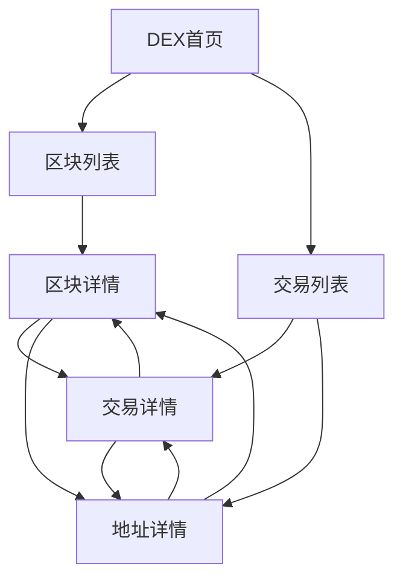

# BiyaDEX 区块浏览器产品需求文档

> 产品经理：Terry｜文档版本：V1.1｜文档状态：正式需求｜日期：2026-09-04

## 文档说明

| 项目 | 内容 |
| --- | --- |
| 需求名称 | BiyaDEX 区块浏览器 P0 |
| 需求等级 | L3 复杂需求 |
| 核心目标 | 为 BiyaDEX 提供公开、只读、可检索的区块、交易和地址数据查询能力 |
| 目标用户 | 交易用户、流动性提供者、做市商、运营与客服、安全研究人员、生态开发者 |
| 交互基线 | [BIYA-Chain-Explorer-DEXScan.html](./BIYA-Chain-Explorer-DEXScan.html) 的 DEX 模式 |
| 编写规范 | [产品需求文档编写规范](../../PRD规范/产品需求文档编写规范.md) |
| 需求范围 | 仅 BiyaDEX 区块浏览器；不包含 EVM 区块浏览器需求 |
| 一句话概述 | 用户无需登录即可查询 BiyaDEX 的网络概况、区块、交易及地址活动，并通过稳定深链分享查询结果 |

**文档定位**

本文把 DEX 原型转化为生产可交付的 P0 产品要求。原型中的模拟数据仅用于表达页面和交互，不构成数据值、刷新频率或链上事实；生产版本必须展示 BiyaDEX 的真实索引数据。

本文是产品、设计、研发、测试和 AI 交付参与者共同使用的业务真相源。本文说明用户可见行为、业务规则和验收边界，不规定数据库、接口路径、索引器内部结构或前端框架。

**撰写语言**

正文和用户可见文案以中文为主。协议交易类型等链上原始标识保留英文，并在有确定业务含义时补充中文解释，例如 `placeOrder（下单）`、`cancel（撤单）`。

---

## 目录

- [1. 本期交付摘要](#1-本期交付摘要)
- [2. 产品概述](#2-产品概述)
- [3. 功能列表与优先级](#3-功能列表与优先级)
- [4. 功能详细说明](#4-功能详细说明)
  - [4.1 全局导航、模式与搜索](#41-全局导航模式与搜索)
  - [4.2 DEX 首页](#42-dex-首页)
  - [4.3 区块列表](#43-区块列表)
  - [4.4 区块详情](#44-区块详情)
  - [4.5 交易列表](#45-交易列表)
  - [4.6 交易详情](#46-交易详情)
  - [4.7 地址详情](#47-地址详情)
- [5. 横切业务规则与异常处理](#5-横切业务规则与异常处理)
- [6. 依赖、历史影响与风险](#6-依赖历史影响与风险)
- [7. 产品验收条件与宣讲路径](#7-产品验收条件与宣讲路径)
- [8. 更新记录](#8-更新记录)

---

## 1. 本期交付摘要

### 1.1 交付结果

本期交付一套 BiyaDEX 公共数据查询产品，形成以下查询闭环：

用户可以从首页了解网络概况，从区块或交易列表进入详情，再通过区块、交易和地址之间的链接交叉核验链上活动。所有详情页均支持直接打开和分享，不依赖从首页逐级进入。

### 1.2 P0 核心能力

| 模块 | P0 交付能力 |
| --- | --- |
| 全局能力 | 默认进入 DEX、仅 BiyaChain 显示 EVM/DEX Tab、全局搜索前缀建议、深链、复制、网络边界 |
| 首页 | 产品介绍、6 项网络统计、最新区块、最新交易 |
| 区块 | 区块列表及高度查询、区块概览、块内交易、地址/哈希/交易类型组合查询 |
| 交易 | 交易列表及类型/哈希/地址组合查询、交易详情、区块与地址互跳 |
| 地址 | 地址详情、地址交易列表、日期范围/交易类型/哈希组合查询 |
| 公共状态 | 加载、空数据、无结果、无效参数、网络错误、重试 |

### 1.3 明确不在本期范围

| 不在范围的能力 | 本期用户可见行为 |
| --- | --- |
| EVM 区块浏览器页面和业务规则 | 本文不定义；切换至 EVM 后由独立需求负责 |
| DEX 下单、撤单、改单或资产转移 | 浏览器只读，不提供交易提交入口 |
| 代币、NFT、合约浏览 | DEX 导航中不展示相关入口 |
| DEX API 文档内容 | P0 不交付文档内容；保留“开发者—API 文档”入口作为能力边界提示，入口不可跳转且不得进入 EVM API 文档 |
| API 账户、套餐、用量和密钥管理 | 不在 DEX 前台展示 |
| 交易详情中的原始请求/返回 JSON | 原型中虽有隐藏结构，P0 不展示 |
| 区块或地址的代币转账 Tab | 原型中的隐藏 Tab 不纳入 P0 |
| 地址二维码 | 原型为占位图，P0 不提供 |
| 登录、注册和个人账户 | 公共查链不要求登录，P0 不展示账户入口 |
| 多语言 | P0 仅提供中文用户界面 |
| 区块链写操作 | 不签名、不广播交易、不修改链上状态 |

---

## 2. 产品概述

### 2.1 背景与当前问题

BiyaDEX 的撮合、交易和结算活动在链上执行。交易用户、流动性提供者、做市商和运营人员需要一个独立于交易终端的公共查询入口，用于确认区块是否产生、交易是否被收录、某地址发生了哪些活动，以及相关数据之间是否一致。

当前 HTML 原型已经表达了 DEX 首页、区块、交易和地址的页面关系，但数据为前端模拟，部分异常会静默回退到默认数据，部分控件为隐藏或占位。若直接按原型实现，不同交付角色可能对真实数据、错误行为和验收结果产生不同理解。

本需求将原型中的有效查询链路固化为生产 P0，并明确：

1. 页面展示 BiyaDEX 的真实索引结果，不使用模拟值冒充链上事实。
2. 查询结果必须能够通过区块高度、交易哈希和地址相互核验。
3. 无数据、查无结果、参数无效和网络错误必须给出不同反馈。
4. DEX 与 EVM 的产品边界保持清晰，DEX 不复用 EVM 的代币、合约和 API 文档。

### 2.2 产品目标

| 目标 | 可观察结果 |
| --- | --- |
| 提供 DEX 网络概览 | 用户进入首页可查看 6 项网络指标及最新区块、最新交易 |
| 提供链上事实查询 | 用户可按区块高度、交易哈希或地址打开对应详情 |
| 提供活动检索 | 用户可在区块列表、交易列表、块内交易和地址交易中使用本文规定的筛选条件 |
| 支持交叉核验 | 区块、交易和地址之间可双向跳转，关联字段保持一致 |
| 支持分享和复现 | 用户复制详情页 URL 后，在新会话中可打开相同 DEX 页面和相同查询对象 |
| 明确失败原因 | 查询失败时区分“无结果”“参数无效”和“网络错误” |

### 2.3 非目标

- 不通过浏览器完成交易或资金操作。
- 不在本需求中定义 EVM 页面、EVM 字段或 EVM 接口。
- 不把所有链上原始数据无差别展示；P0 只展示本文字段表规定的业务字段。
- 不承诺 DEX API 对外开放。
- 不以原型中的固定总量、固定时间和固定地址作为生产数据。
- 不把索引系统内部设计写入本 PRD。

### 2.4 目标用户与场景

| 用户角色 | 典型场景 | 需要完成的目标 |
| --- | --- | --- |
| 交易用户 | 在交易终端提交操作后核验是否上链 | 通过交易哈希找到交易，查看所属区块、时间、类型和发起地址 |
| 流动性提供者 | 核对某地址参与 DEX 的活动 | 在地址详情按日期、交易类型或哈希查询交易 |
| 做市商 | 核对批量交易或特定区块活动 | 查看区块及块内交易，并按地址或交易类型缩小范围 |
| 运营与客服 | 处理用户“交易未找到”“数据不一致”等反馈 | 通过深链复现查询，识别查无结果、参数无效或网络错误 |
| 安全研究人员 | 调查异常交易或地址行为 | 在区块、交易和地址之间交叉核验公开数据 |
| 生态开发者 | 理解 BiyaDEX 的公开链上活动 | 使用浏览器查链；P0 不提供 DEX API 文档 |

所有 P0 页面均为公开只读页面，不因角色不同改变数据可见范围，也不要求登录。

### 2.5 术语与统一口径

| 术语 | 定义 |
| --- | --- |
| BiyaDEX | 与 BiyaChain 分离的高性能链上交易网络；用户资产从 BiyaChain 跨入后，在 BiyaDEX 上进行交易活动 |
| LP（流动性提供者） | 向市场提供资金或流动性、并关注链上交易和地址活动的用户或机构 |
| DEX 区块浏览器 | 本需求定义的 BiyaDEX 公共只读查询产品 |
| 区块高度 | 区块在 BiyaDEX 上的唯一连续编号 |
| 区块内交易数 | 被该区块收录的交易记录数量；原型部分位置称“成交数”，生产文案统一为“交易数” |
| 交易 | 被 BiyaDEX 收录的一次协议动作，不等同于用户界面中的订单或单次撮合成交 |
| 交易类型 | 协议为交易动作定义的原始类型标识，例如 `placeOrder`、`cancel` |
| 发起地址 | 发起 DEX 协议交易的链上账户标识；P0 各交易列表的“地址”列统一改称“发起地址” |
| 最新 | 在可公开查询的数据中，按区块高度或交易收录顺序倒序后的第一条 |
| 链上总量 | 数据源确认的累计总数 |
| 可浏览范围 | 前台允许通过页码查看的最新记录集合，P0 上限为最近 10,000 条 |
| 深链 | 包含 DEX 模式和查询对象参数、可直接打开目标页面的 URL |
| 查无结果 | 查询参数格式有效，但当前公开索引范围内不存在对应数据 |
| 参数无效 | 输入不符合区块高度、交易哈希或地址的格式规则 |

**产品关系说明**：在网络选择层，只有 BiyaChain（界面显示 `BIYA Mainnet`）同时提供 EVM 和 DEX 两套浏览模式，因此仅选择 BiyaChain 时显示 EVM/DEX Tab 切换组件。Polygon 等其他网络只提供 EVM 浏览模式，不显示该切换组件。BiyaChain 与 BiyaDEX 在底层仍是两套独立的链上执行环境，资产从 BiyaChain 跨入 BiyaDEX 后进行交易；本文只定义进入 DEX 后的可见行为，不定义各网络的 EVM 页面需求。

### 2.6 页面地图

| 页面 | 标准入口 | 主要任务 |
| --- | --- | --- |
| DEX 首页 | `#home?mode=dexscan` | 查看网络概况和最新数据 |
| 区块列表 | `#blocks?mode=dexscan`，可选 `height`、`page` | 浏览最近区块，并按区块高度查询 |
| 区块详情 | `#block?mode=dexscan&number={区块高度}` | 查看区块概览和块内交易 |
| 交易列表 | `#txs?mode=dexscan`，可选 `type`、`hash`、`address`、`page` | 浏览最近交易，并按类型、哈希、地址查询 |
| 交易详情 | `#tx?mode=dexscan&hash={交易哈希}` | 核验单笔交易 |
| 地址详情 | `#address?mode=dexscan&address={地址}` | 查看地址及其交易活动 |

URL 参数名称是现有原型的交互约定。若研发调整路由实现，不得改变“深链可直接打开并复现同一业务状态”的产品结果。

---

## 3. 功能列表与优先级

| 功能模块 | 功能点 | 优先级 | 说明 |
| --- | --- | --- | --- |
| 全局 | 默认进入 DEX | P0 | 无明确模式时进入 BiyaDEX 首页 |
| 全局 | DEX/EVM 模式边界 | P0 | BiyaChain 显示 EVM/DEX Tab；其他网络不显示该组件 |
| 全局 | 网络边界 | P0 | 只有 BiyaChain 同时支持 EVM 和 DEX，其他网络仅支持 EVM |
| 全局 | 搜索与深链 | P0 | 输入即出前缀建议；完整值直达详情；无结果留在当前页 |
| 全局 | 复制与长文本 | P0 | 哈希和地址可查看全文并复制 |
| 首页 | 网络统计 | P0 | 6 项指标 |
| 首页 | 最新区块与最新交易 | P0 | 各展示最近 10 条 |
| 区块 | 区块列表 | P0 | 5 列、默认倒序、20 条/页、按高度查询 |
| 区块 | 区块详情 | P0 | 概览、前后区块、块内交易 |
| 区块 | 块内交易查询 | P0 | 地址、哈希、交易类型组合查询 |
| 交易 | 交易列表 | P0 | 5 列、类型/哈希/地址组合查询、20 条/页 |
| 交易 | 交易详情 | P0 | 5 项核心字段与关联跳转 |
| 地址 | 地址详情 | P0 | 完整地址、复制、交易列表 |
| 地址 | 地址交易查询 | P0 | 日期范围、交易类型、哈希组合查询 |
| 公共状态 | 加载、空数据、无结果、无效参数、网络错误和重试 | P0 | 所有数据页面适用 |
| 开发者 | DEX API 文档不可用 | P0 | 禁止误跳到 EVM API 文档 |

---

## 4. 功能详细说明

## 4.1 全局导航、模式与搜索

**用户目标**

用户从任意 DEX 页面都能识别当前网络和模式，进入区块或交易主路径，搜索目标对象，并分享当前查询状态。

### 4.1.1 流程步骤

| 步骤 | 用户操作 | 系统行为 | 可见结果 |
| --- | --- | --- | --- |
| 1 | 首次打开浏览器且 URL 未指定模式 | 选择 BIYA 网络和 DEX 模式 | 进入 DEX 首页，DEX 状态处于选中 |
| 2 | 打开带 `mode=dexscan` 的深链 | 解析页面和对象参数 | 直接进入对应 DEX 列表或详情 |
| 3 | 展开“区块链”菜单 | 展示“交易列表”“区块列表” | 用户可进入两类列表 |
| 4 | 在全局搜索框输入内容 | 按前缀规则即时检索当前链可匹配对象 | 下拉展示建议；无命中时在下拉内显示空态，不离开当前页 |
| 5 | 点击地址、哈希或区块链接 | 保留 DEX 上下文并打开关联页 | 目标页仍处于 DEX 模式 |
| 6 | 点击“开发者—API 文档” | 阻止导航 | 当前页面不变，入口提示“暂无 DEX API 文档” |
| 7 | 从 BiyaChain 切换到其他网络 | 退出 DEX 并进入目标网络 EVM 浏览面 | EVM/DEX Tab 切换组件完全隐藏 |
| 8 | 从其他网络切换回 BiyaChain | 进入 BiyaChain 默认 DEX 首页 | 重新显示 EVM/DEX Tab，DEX 处于选中状态 |

### 4.1.2 搜索识别规则

全局搜索以**从左往右的前缀匹配**提供建议，不在输入过程中自动跳转。检索范围是当前网络、当前 DEX 模式下可公开查询的交易哈希、地址和区块高度。占位文案为“搜索区块高度 / 交易哈希 / 地址”。

**输入即检索**

| 输入 | 匹配对象 | 匹配规则 | 展示 |
| --- | --- | --- | --- |
| 去除首尾空格后为空 | 无 | 不检索 | 收起下拉，不显示错误 |
| 仅十进制数字 | 区块高度 | 完整高度字符串以输入为前缀 | 区块建议 |
| 其他非空文本 | 交易哈希、地址 | 完整值以输入为前缀，不区分大小写 | 交易建议、地址建议 |
| 任意非空文本 | 以上对象均无前缀命中 | 不适用 | 下拉内显示空态，停留当前页 |

建议规则：

1. 每一类最多展示 10 条，分类计数按实际展示条数，不超过 10。
2. 同时命中多类时，下拉用 Tab 区分“交易”“区块”“地址”，只显示有结果的分类。
3. 默认选中第一类有结果的 Tab，优先顺序为交易、区块、地址。
4. 命中前缀在建议项中高亮。
5. 精确完整值排在同类建议最前；区块建议在同等条件下按高度从高到低。
6. 无命中时下拉标题为“无搜索结果”，说明为“未在当前链找到相关结果，请确认搜索内容”。不打开独立搜索结果页，不改写当前页面。
7. P0 不支持代币、NFT、合约、订单号、中间/后缀模糊或自然语言搜索。输入过程不把交易类型当作建议对象。

**提交（Enter 或搜索按钮）**

| 提交内容 | 系统行为 | 可见结果 |
| --- | --- | --- |
| 空 | 不跳转 | 收起下拉，保持当前页 |
| 完整交易哈希（`0x` + 64 位十六进制）且有前缀命中 | 打开该交易详情 | 进入交易详情 |
| 完整地址（`0x` + 40 位十六进制）且有前缀命中 | 打开该地址详情 | 进入地址详情；无交易地址仍打开并显示空状态 |
| 纯数字且有区块前缀命中 | 打开建议中的第一条区块 | 进入区块详情；精确完整高度优先，否则按高度从高到低取第一条 |
| 前缀命中恰好 1 条 | 打开该对象详情 | 进入对应详情 |
| 哈希或地址前缀命中多于 1 条，且不是完整哈希/地址 | 不跳转 | 保持建议下拉，由用户点选 |
| 无前缀命中，但与某协议交易类型完全匹配（不区分大小写） | 打开交易列表并应用该类型 | 交易列表只显示该类型 |
| 其他无命中 | 不跳转 | 下拉保持“无搜索结果” |

点选建议项后打开对应 DEX 详情，并关闭下拉。用户点选完整且存在的对象后，详情页按各页面规则展示；若对象格式有效但不存在，由详情页给出“未找到该交易”或“未找到该区块”。

### 4.1.3 页面状态矩阵

| 场景 | 触发条件 | 页面展示 | 用户可操作 | 是否保留输入 |
| --- | --- | --- | --- | --- |
| BiyaChain DEX 默认态 | 选择 BiyaChain 且进入 DEX | 显示 EVM/DEX Tab，DEX 选中；显示 DEX 导航 | 搜索、进入列表、切换模式 | 是 |
| BiyaChain EVM 状态 | 选择 BiyaChain 并点击 EVM | 显示 EVM/DEX Tab，EVM 选中；退出 DEX 页面 | 使用 BiyaChain EVM 已有能力或切回 DEX | 不适用 |
| 其他网络 | 用户切换到 Polygon 等其他网络 | 只进入目标网络 EVM 浏览面；完全不显示 EVM/DEX Tab 切换组件 | 使用目标网络 EVM 已有能力、切换网络 | 不适用 |
| 搜索建议 | 输入非空且有前缀命中 | 搜索框下方展示分类建议 | 点选、切换分类、继续输入、提交 | 是 |
| 搜索无命中 | 输入非空且无前缀命中，也不是精确交易类型 | 下拉显示“无搜索结果”，当前页不变 | 修改搜索内容 | 是 |
| 搜索直达 | 提交命中唯一完整对象 | 关闭下拉并打开对应详情 | 查看详情或返回 | 是 |
| 查无结果 | 打开的详情对象格式有效但不存在 | 目标详情页显示对应无结果状态 | 返回或重新搜索 | 是 |
| DEX API 不可用 | 用户展开开发者菜单 | API 文档入口置为不可用并显示说明 | 关闭菜单、使用其他导航 | 不适用 |

### 4.1.4 字段说明

| 界面字段 | 数据来源 | 展示规则 | 空值/异常 | 校验/交互 |
| --- | --- | --- | --- | --- |
| 品牌名 | 产品配置 | `BIYA Explorer` | 不允许为空 | 点击返回当前网络的 DEX 首页 |
| 当前网络 | 网络配置 | BiyaChain 显示 `BIYA Mainnet` | 配置异常时不进入 DEX | 可展开网络列表 |
| EVM/DEX Tab 切换组件 | 当前网络与页面状态 | 仅 BiyaChain 显示；DEX 页面中 `DEX` 选中 | 其他网络完全隐藏组件，不保留空白占位 | 在 BiyaChain 点击 EVM 退出 DEX；EVM 页面后续行为不在本文定义 |
| 页面标题 | 当前网络 | BiyaChain 网络显示 `BiyaChain` | 不允许为空 | 只读 |
| 全局搜索内容 | 用户输入 | 原样保留；检索前去除首尾空格 | 无命中时下拉提示无结果 | 输入即出建议；Enter 或搜索按钮按提交规则处理 |
| 开发者入口 | 产品能力状态 | 显示“API 文档”及不可用提示 | 不允许进入 EVM API 文档 | DEX 下点击不跳转 |

### 4.1.5 交互规则

| 场景 | 触发条件 | 反馈形式 | 返回后是否保留 |
| --- | --- | --- | --- |
| 列表进入详情 | 点击区块、哈希或地址 | 当前窗口打开详情 | 浏览器返回后恢复原列表页、页码和筛选 |
| 深链打开 | 新会话打开有效 DEX URL | 直接还原页面、对象及该页面在 §5.5 规定的可分享状态 | 不适用 |
| 复制 | 点击哈希或地址旁复制按钮 | 复制完整值并显示 1.5 秒成功反馈 | 不适用 |
| 查看长文本 | 哈希或地址在列表中被截断 | 悬停或聚焦时展示完整值 | 不适用 |
| 切换至其他网络 | 从 BiyaChain 切换到其他网络 | 退出 DEX，上屏目标网络 EVM 页面，并隐藏 EVM/DEX Tab | 返回 BiyaChain 后默认进入 BiyaChain 的 DEX 首页 |
| 切回 BiyaChain | 从其他网络切换到 BiyaChain | 显示 EVM/DEX Tab，默认选中 DEX | 进入 BiyaChain DEX 首页 |
| API 文档 | DEX 下点击不可用入口 | 页面不变；提示“暂无 DEX API 文档” | 当前状态完整保留 |

### 4.1.6 验收标准

| 序号 | 验收条件 | 预期结果 |
| --- | --- | --- |
| AC-G01 | 用户不带页面参数首次打开浏览器 | 进入 BiyaDEX 首页，DEX 显示为当前模式 |
| AC-G02 | 用户在新会话打开任一有效 DEX 详情深链 | 直接打开该对象详情，且页面保持 DEX 模式 |
| AC-G03 | 用户分别提交完整且可命中的区块高度、交易哈希和地址 | 分别进入对应区块、交易和地址详情 |
| AC-G04 | 用户提交已知交易类型，且该输入没有哈希/地址/高度前缀命中 | 进入交易列表且仅应用该交易类型筛选 |
| AC-G05 | 用户输入无法前缀命中、也不是精确交易类型的文本 | 不跳转，当前页不变，下拉显示“无搜索结果” |
| AC-G06 | 用户在 DEX 下点击“API 文档” | URL 和当前页面不变，入口提示“暂无 DEX API 文档” |
| AC-G07 | 用户从列表进入详情后执行浏览器返回 | 恢复进入详情前的列表页、页码和筛选 |
| AC-G08 | 用户复制列表中被截断的地址或哈希 | 剪贴板内容为完整值，页面出现复制成功反馈 |
| AC-G09 | 用户选择 BiyaChain | 页面显示 EVM/DEX Tab 切换组件；进入 DEX 时 DEX 处于选中状态 |
| AC-G10 | 用户选择任一非 BiyaChain 网络 | 页面只展示该网络的 EVM 浏览面，EVM/DEX Tab 切换组件完全隐藏且不占位 |
| AC-G11 | 用户输入同时命中交易和地址的前缀，例如 `0x` | 下拉出现“交易”“地址”分类，每类最多 10 条，命中前缀高亮 |
| AC-G12 | 用户输入纯数字区块高度前缀且存在多条匹配 | 下拉只出现“区块”分类；提交后打开排序后的第一条区块详情 |

---

## 4.2 DEX 首页

**用户目标**

用户进入 DEX 后快速了解网络规模和当前活动，并进入最新区块或最新交易。

### 4.2.1 产品介绍

首页使用以下产品介绍：

> BiyaDEX 是一条专为 LP 打造的高性能链上交易网络，撮合、成交与结算全部在链上透明完成。机构级体验：毫秒级延迟、零 Gas。资产从 BiyaChain 跨入后即可下单交易；流动性、交易者与做市商在同一平台协同，兼得中心化交易所的速度与链上托管的透明度。

此段为产品宣介文案，不作为性能、费用或资金路径的验收数据来源。有关“毫秒级延迟”“零 Gas”的外部承诺须由对应业务规则和技术能力另行保证。

### 4.2.2 流程步骤

| 步骤 | 用户操作 | 系统行为 | 可见结果 |
| --- | --- | --- | --- |
| 1 | 进入 DEX 首页 | 加载网络统计、最新区块和最新交易 | 三个区域分别进入加载态 |
| 2 | 等待数据返回 | 展示已完成索引的最新数据 | 看到 6 项统计和两组列表 |
| 3 | 点击最新区块 | 打开对应区块详情 | 可查看区块概览和块内交易 |
| 4 | 点击最新交易 | 打开对应交易详情 | 可查看交易核心字段 |
| 5 | 点击发起地址或提议者 | 打开对应地址详情 | 可查看该地址的交易活动 |
| 6 | 点击“查看全部” | 打开对应列表页 | 进入区块列表或交易列表 |

### 4.2.3 展示字段

#### 网络统计

| 界面字段 | 业务含义 | 数据来源 | 展示规则 | 空值/异常 |
| --- | --- | --- | --- | --- |
| 总交易数 | 从创世区块至当前最高已索引区块，被 BiyaDEX 收录的交易记录总数 | BiyaDEX 公开索引数据 | 非负整数，千分位展示 | 单项不可用显示 `--` |
| 24 小时链上交易数 | 以当前时刻向前滚动 24 小时，被 BiyaDEX 收录的交易记录数 | BiyaDEX 公开索引数据 | 非负整数 | 单项不可用显示 `--` |
| 地址总数 | 从创世区块至当前最高已索引区块，至少发起过一笔 BiyaDEX 交易的唯一地址数 | BiyaDEX 公开索引数据 | 按发起地址去重，非负整数；旁侧增量为滚动 24 小时首次发起交易的新增地址数 | 单项不可用显示 `--`；新增地址数不可用时只隐藏增量 |
| 24 小时活跃地址数 | 以当前时刻向前滚动 24 小时，至少发起过一笔 BiyaDEX 交易的唯一地址数 | BiyaDEX 公开索引数据 | 按发起地址去重，非负整数 | 单项不可用显示 `--` |
| 实时 TPS | 最近连续 60 秒内被 BiyaDEX 收录的交易记录数除以 60 | BiyaDEX 公开索引数据 | 每 60 秒窗口滚动计算，四舍五入保留 1 位小数，单位“笔/秒” | 不足完整 60 秒窗口或不可用时显示 `--`，不得显示模拟值 |
| 最新区块高度 | 当前已完成索引的最高区块高度 | BiyaDEX 公开索引数据 | 十进制整数 | 不可用时显示 `--` |

#### 最新区块

| 界面字段 | 数据来源 | 展示规则 | 空值/异常 | 交互 |
| --- | --- | --- | --- | --- |
| 区块高度 | 区块数据 | 展示完整值 | 不允许为空 | 点击进区块详情 |
| 时间 | 区块时间 | 默认展示相对时间；悬停可见绝对时间 | 无时间显示 `--` | 只读 |
| 提议者 | 区块数据 | 列表截断，支持全文提示 | 无提议者显示 `--` | 点击进地址详情；可复制 |
| 交易数 | 区块内交易数量 | 非负整数，文案“N 笔交易” | 0 显示“0 笔交易” | 只读 |

#### 最新交易

| 界面字段 | 数据来源 | 展示规则 | 空值/异常 | 交互 |
| --- | --- | --- | --- | --- |
| 交易哈希 | 交易数据 | 列表截断，支持全文提示 | 不允许为空 | 点击进交易详情；可复制 |
| 发起地址 | 交易数据 | 列表截断，支持全文提示 | 无地址显示 `--` | 点击进地址详情；可复制 |
| 交易类型 | 交易数据 | 原始标识；有确定映射时附中文 | 未识别类型仍展示原始标识 | 可作为交易列表筛选值 |

首页最新区块按区块高度倒序展示，最新交易按链上收录顺序倒序展示；两组各展示最多 10 条。

### 4.2.4 页面状态矩阵

| 场景 | 触发条件 | 页面展示 | 用户可操作 | 是否保留已有数据 |
| --- | --- | --- | --- | --- |
| 首次加载 | 进入首页 | 统计区和两列表分别显示加载占位 | 可使用全局导航 | 不适用 |
| 正常 | 三类数据返回 | 展示统计和列表 | 查看全部、进入详情 | 是 |
| 部分失败 | 统计或某一列表失败 | 成功区域正常展示；失败区域显示“加载失败，请重试” | 重试失败区域 | 是 |
| 全部失败 | 首页数据均失败 | 显示“数据加载失败，请检查网络后重试” | 重试 | 否 |
| 暂无数据 | 网络尚无可公开数据 | 指标为 0 或 `--`；列表显示“暂无区块”或“暂无交易” | 等待后重试 | 不适用 |
| 自动更新 | 新区块完成索引 | 列表顶部出现新记录，统计更新 | 继续浏览 | 是 |

### 4.2.5 交互规则

- 自动更新不得打断用户正在进行的点击、文本选择或菜单操作。
- 新记录加入后，列表仍最多保留 10 条。
- 单个统计值不可用时只降级该字段，不阻断两组列表。
- “查看全部区块”和“查看全部交易”必须保留 DEX 模式。
- 产品介绍支持展开与收起；切换后不影响数据加载。

### 4.2.6 验收标准

| 序号 | 验收条件 | 预期结果 |
| --- | --- | --- |
| AC-H01 | 用户进入数据正常的 DEX 首页 | 展示 6 项统计、最多 10 条最新区块和最多 10 条最新交易 |
| AC-H02 | 首页某一统计值不可用 | 该值显示 `--`，其他指标和列表仍可查看 |
| AC-H03 | 最新区块的交易数为 0 | 页面显示“0 笔交易”，不隐藏该区块 |
| AC-H04 | 用户点击最新区块、交易或发起地址 | 分别进入对应 DEX 详情页 |
| AC-H05 | 用户点击两处“查看全部” | 分别进入 DEX 区块列表和 DEX 交易列表 |
| AC-H06 | 首页一组列表加载失败 | 失败组可独立重试，成功区域不被清空 |

---

## 4.3 区块列表

**用户目标**

用户按从新到旧的顺序浏览 BiyaDEX 区块，可按区块高度缩小范围，了解时间、区块内交易数、提议者和区块哈希，并进入详情。

### 4.3.1 流程步骤

| 步骤 | 用户操作 | 系统行为 | 可见结果 |
| --- | --- | --- | --- |
| 1 | 从导航或首页进入区块列表 | 请求第 1 页、每页 20 条 | 列表进入加载态 |
| 2 | 数据返回 | 按区块高度降序展示 | 第一行为当前可查询的最高区块 |
| 3 | 输入区块高度 | 在可浏览的最近 10,000 个区块内按高度前缀过滤，回到第 1 页 | 列表、条数和分页按匹配结果更新 |
| 4 | 点击分页 | 加载当前查询结果的目标页 | 页面显示目标页并回到列表顶部 |
| 5 | 点击区块高度或哈希 | 打开该区块详情 | 详情对象与所点行一致 |
| 6 | 点击提议者 | 打开地址详情 | 展示所点地址 |
| 7 | 浏览器返回 | 恢复原页码和高度查询 | 无需重新从第 1 页查找 |

### 4.3.2 展示字段

| 界面字段 | 业务含义 | 展示规则 | 空值/异常 | 交互 |
| --- | --- | --- | --- | --- |
| 区块高度 | 区块编号 | 完整十进制整数 | 不允许为空 | 点击进区块详情 |
| 时间 | 区块时间 | 相对时间，全文提示绝对时间 | 不可用显示 `--` | 只读 |
| 交易数 | 区块内交易数 | 非负整数 | 0 原样展示 | 只读 |
| 提议者 | 区块提议地址 | 截断展示，可见全文 | 不可用显示 `--` | 点击进地址详情；可复制 |
| 区块哈希 | 区块唯一哈希 | 截断展示，可见全文 | 不允许为空 | 点击进区块详情；可复制 |

### 4.3.3 查询条件与规则

| 查询条件 | 组件 | 默认值 | 匹配规则 | 清除后的行为 |
| --- | --- | --- | --- | --- |
| 区块高度 | 文本输入 | 空 | 去除首尾空格后，仅接受十进制数字；完整高度字符串以输入为从左到右前缀 | 恢复最近 10,000 个区块的默认列表 |

查询规则：

1. 筛选只在按高度倒序的最近 10,000 个区块内执行。
2. 输入变化后从第 1 页展示结果。
3. 完整高度命中时只返回该区块；前缀命中时返回全部匹配高度，仍按高度从高到低。
4. 输入含非数字字符时视为格式无效，不把逗号或空格当作数字的一部分。
5. 高度查询和页码写入可分享状态；刷新页面后保持。
6. 有查询条件时，条数展示匹配数量，并标明统计范围是近 1 万条内。

### 4.3.4 业务规则

- 默认按区块高度从高到低排序，P0 不提供排序切换。
- 每页固定 20 条。
- 无查询时同时展示链上区块总量和“仅支持浏览最近 10,000 个区块”的说明。
- 无查询时可浏览页数按 `min(链上总量, 10,000) ÷ 20` 向上取整；有查询时按匹配条数重算。
- 页码小于 1 时按第 1 页处理；页码大于末页时按末页处理。
- 第 1 页“上一页”不可用；末页“下一页”不可用。
- 新区块产生不强制将正在浏览历史页或带查询条件的用户跳回第 1 页。

### 4.3.5 页面状态矩阵

| 场景 | 触发条件 | 页面展示 | 用户可操作 |
| --- | --- | --- | --- |
| 加载中 | 首次进入、切页或修改高度查询 | 表格加载占位，分页防重复点击 | 返回、使用全局导航、继续改查询 |
| 正常 | 当前页有数据 | 5 列区块表、查询框和分页 | 查询、翻页、进详情、进地址 |
| 查询无结果 | 高度格式有效但近 1 万条内无前缀命中 | “无匹配区块”，条数为 0，查询条件保留 | 修改或清除高度 |
| 高度格式无效 | 高度参数不是十进制数字 | “区块高度格式无效”，条数为 0 | 修改查询、返回 |
| 空状态 | 网络无区块 | “暂无区块数据” | 重试 |
| 网络错误 | 请求失败 | “区块列表加载失败，请重试” | 重试、返回 |
| 超界页码 | URL 页码超过当前结果范围 | 展示实际末页 | 正常翻页 |

### 4.3.6 验收标准

| 序号 | 验收条件 | 预期结果 |
| --- | --- | --- |
| AC-BL01 | 用户进入区块列表第 1 页 | 最多展示 20 条，区块高度按降序排列 |
| AC-BL02 | 链上总量超过 10,000 | 页面展示链上总量及“仅支持浏览最近 10,000 个区块” |
| AC-BL03 | 用户在第 1 页或末页查看分页 | 对应上一页或下一页按钮不可用 |
| AC-BL04 | 用户点击区块高度或区块哈希 | 两者均打开该行对应的区块详情 |
| AC-BL05 | 用户点击提议者 | 打开该地址的 DEX 地址详情 |
| AC-BL06 | 列表加载失败 | 页面保留导航并提供可执行的重试入口 |
| AC-BL07 | 用户输入完整且在可浏览范围内的区块高度 | 列表只展示该区块，页码为第 1 页 |
| AC-BL08 | 用户输入高度前缀且存在多条匹配 | 结果中每条高度均以该前缀开头，并按高度降序 |
| AC-BL09 | 用户输入无匹配的高度或刷新带该条件的 URL | 显示“无匹配区块”和 0 条结果，查询条件保留 |

---

## 4.4 区块详情

**用户目标**

用户核验指定区块的时间、哈希、提议者和块内交易，并按地址、哈希或交易类型定位块内交易。

### 4.4.1 流程步骤

| 步骤 | 用户操作 | 系统行为 | 可见结果 |
| --- | --- | --- | --- |
| 1 | 输入区块高度或从列表进入 | 校验高度并查询区块 | 展示区块概览 |
| 2 | 点击上一块或下一块 | 查询相邻高度 | 打开相邻区块详情 |
| 3 | 区块有交易时点击“交易”Tab | 加载第 1 页块内交易 | 展示交易表和查询工具栏 |
| 4 | 输入地址或哈希关键字，或选择交易类型 | 以逻辑与关系组合条件 | 更新条数、列表和分页 |
| 5 | 点击交易哈希 | 打开交易详情 | 详情与所点交易一致 |
| 6 | 点击提议者或交易发起地址 | 打开地址详情 | 地址与所点值一致 |

### 4.4.2 区块概览字段

| 界面字段 | 数据来源 | 展示规则 | 空值/异常 | 交互 |
| --- | --- | --- | --- | --- |
| 区块高度 | 区块数据 | 完整十进制整数 | 不允许为空 | 支持前后区块导航 |
| 时间 | 区块数据 | 绝对时间 | 不可用显示 `--` | 只读 |
| 区块哈希 | 区块数据 | 完整值 | 不允许为空 | 可复制 |
| 提议者 | 区块数据 | 完整地址 | 不可用显示 `--` | 点击进地址详情；可复制 |

P0 概览不展示原型中隐藏的“状态”“区块大小”等字段。

### 4.4.3 块内交易字段与筛选

| 界面字段 | 展示规则 | 交互 |
| --- | --- | --- |
| 交易哈希 | 截断展示，可见全文 | 点击进交易详情；可复制 |
| 交易类型 | 原始协议标识；有映射时附中文 | 可通过类型筛选 |
| 区块高度 | 当前区块高度 | 点击保持在当前区块 |
| 时间 | 绝对时间 | 只读 |
| 发起地址 | 发起交易的地址，截断展示，可见全文 | 点击进地址详情；可复制 |

| 查询条件 | 组件 | 默认值 | 匹配规则 | 清除后的行为 |
| --- | --- | --- | --- | --- |
| 发起地址关键字 | 文本输入 | 空 | 去除首尾空格后，不区分大小写，匹配完整发起地址中的连续子串 | 恢复其他条件下结果 |
| 哈希关键字 | 文本输入 | 空 | 去除首尾空格后，不区分大小写，匹配完整交易哈希中的连续子串 | 恢复其他条件下结果 |
| 交易类型 | 单选下拉 | 全部 | 与协议交易类型标识完全匹配 | 恢复全部类型 |

查询规则：

1. 三个条件同时存在时按逻辑与关系组合。
2. 文本输入变化后从第 1 页展示结果。
3. 选择交易类型后从第 1 页展示结果。
4. 筛选只在当前区块的交易集合内执行。
5. 每页固定 20 条，分页总页数随筛选结果变化。

### 4.4.4 页面状态矩阵

| 场景 | 触发条件 | 页面展示 | 用户可操作 | 是否保留查询条件 |
| --- | --- | --- | --- | --- |
| 概览加载中 | 有效高度首次打开 | 概览加载占位 | 返回 | 不适用 |
| 正常有交易 | 区块存在且交易数大于 0 | “概览”“交易”Tab | 查看概览或交易 | 是 |
| 正常无交易 | 区块存在且交易数为 0 | 仅显示“概览”；不显示“交易”Tab | 前后区块、地址跳转 | 不适用 |
| 查询中 | 修改查询条件 | 表格显示更新状态，防止重复请求堆叠 | 继续修改条件 | 是 |
| 查询无结果 | 组合条件无匹配 | “无匹配交易”，条数为 0 | 修改或清除条件 | 是 |
| 区块不存在 | 高度格式有效但无数据 | “未找到该区块” | 返回区块列表、重新搜索 | 不适用 |
| 参数无效 | 高度不是非负整数 | “区块高度格式无效” | 修改搜索、返回列表 | 不适用 |
| 网络错误 | 查询失败 | “区块详情加载失败，请重试” | 重试、返回 | 是 |

不得以默认区块内容替代不存在或无效的区块。

### 4.4.5 验收标准

| 序号 | 验收条件 | 预期结果 |
| --- | --- | --- |
| AC-BD01 | 用户打开存在的区块 | 概览展示与该区块一致的高度、时间、哈希和提议者 |
| AC-BD02 | 用户打开交易数为 0 的区块 | 页面不显示“交易”Tab，也不显示伪造交易 |
| AC-BD03 | 用户按发起地址关键字查询块内交易 | 结果中的每条发起地址均包含该关键字 |
| AC-BD04 | 用户按哈希关键字查询块内交易 | 结果中的每条交易哈希均包含该关键字 |
| AC-BD05 | 用户选择某交易类型 | 结果中的每条交易均为该类型 |
| AC-BD06 | 用户同时使用三项条件 | 结果同时满足地址、哈希和交易类型，分页从第 1 页开始 |
| AC-BD07 | 查询没有匹配交易 | 显示“无匹配交易”和 0 条结果，查询条件保留 |
| AC-BD08 | 用户打开不存在或格式无效的区块 | 显示对应无结果或格式错误，不回退到其他区块 |
| AC-BD09 | 用户点击上一块或下一块 | 打开相邻有效区块；到达边界时对应按钮不可用 |

---

## 4.5 交易列表

**用户目标**

用户浏览最近的 BiyaDEX 交易，并按交易类型、哈希或地址缩小范围后进入交易、区块或地址详情。

### 4.5.1 流程步骤

| 步骤 | 用户操作 | 系统行为 | 可见结果 |
| --- | --- | --- | --- |
| 1 | 从导航或首页进入交易列表 | 请求第 1 页、每页 20 条 | 列表进入加载态 |
| 2 | 选择交易类型 | 按类型过滤并回到第 1 页 | 列表只显示该类型 |
| 3 | 在类型下拉中输入关键字 | 过滤可选择的类型名称 | 显示匹配类型或“无匹配类型” |
| 4 | 输入哈希或地址关键字 | 与其他非空条件按逻辑与组合，回到第 1 页 | 列表、条数和分页按匹配结果更新 |
| 5 | 点击交易哈希 | 打开交易详情 | 展示所点交易 |
| 6 | 点击区块高度 | 打开区块详情的交易上下文 | 可核验交易所在区块 |
| 7 | 点击发起地址 | 打开地址详情 | 可查看该地址的活动 |

### 4.5.2 展示字段

| 界面字段 | 展示规则 | 空值/异常 | 交互 |
| --- | --- | --- | --- |
| 交易哈希 | 截断展示，可见全文 | 不允许为空 | 点击进交易详情；可复制 |
| 交易类型 | 原始协议标识；有映射时附中文 | 未识别类型展示原始标识 | 可作为筛选值 |
| 区块高度 | 完整十进制整数 | 不允许为空 | 点击进区块详情 |
| 时间 | 绝对时间 | 不可用显示 `--` | 只读 |
| 发起地址 | 发起交易的地址，截断展示，可见全文 | 不可用显示 `--` | 点击进地址详情；可复制 |

### 4.5.3 查询条件与规则

| 查询条件 | 组件 | 默认值 | 匹配规则 | 清除后的行为 |
| --- | --- | --- | --- | --- |
| 交易类型 | 单选下拉 | 全部 | 与协议交易类型标识完全匹配 | 恢复其他条件下结果 |
| 哈希关键字 | 文本输入 | 空 | 去除首尾空格后，不区分大小写，匹配完整交易哈希中的连续子串 | 恢复其他条件下结果 |
| 地址关键字 | 文本输入 | 空 | 去除首尾空格后，不区分大小写，匹配完整发起地址中的连续子串 | 恢复其他条件下结果 |

查询规则：

1. 三个条件同时存在时按逻辑与关系组合。
2. 筛选只在按链上收录顺序倒序的最近 10,000 条全链交易内执行。
3. 修改任一条件后从第 1 页展示结果。
4. 交易类型筛选必须真实改变结果集合，不得仅修改每行显示文本。
5. 选择“全部”只清除类型条件，不影响哈希和地址关键字。
6. 类型、哈希、地址和页码写入可分享状态；刷新页面后保持。
7. 有任一查询条件时，条数展示匹配数量，并标明统计范围是近 1 万条内。

### 4.5.4 业务规则

- 默认按链上收录顺序从新到旧排列，P0 不提供排序切换。
- 每页固定 20 条。
- 无查询时展示链上交易总量，并说明仅支持浏览最近 10,000 条交易。
- 类型下拉的数据范围以当前可查询的 BiyaDEX 协议交易类型为准，不把前端静态枚举作为权威来源。
- 类型下拉支持搜索可用类型；搜索只过滤下拉选项，不直接改变交易结果。

### 4.5.5 页面状态矩阵

| 场景 | 触发条件 | 页面展示 | 用户可操作 |
| --- | --- | --- | --- |
| 加载中 | 首次进入、切页或修改查询条件 | 表格加载占位 | 返回、使用全局导航、继续改查询 |
| 正常 | 当前页有交易 | 5 列交易表、查询栏和分页 | 筛选、翻页、进详情 |
| 类型无结果 | 仅应用有效类型且可浏览范围无该类型 | “暂无该类型交易” | 清除类型或改其他条件 |
| 查询无结果 | 含哈希或地址条件，或组合条件无匹配 | “无匹配交易”，条数为 0 | 修改或清除条件 |
| 类型不存在 | 深链中的类型不在可用类型中 | “交易类型无效” | 选择有效类型或全部 |
| 网络错误 | 请求失败 | “交易列表加载失败，请重试” | 重试、返回 |
| 超界页码 | URL 页码超过结果范围 | 展示当前筛选结果的末页 | 正常翻页 |

### 4.5.6 验收标准

| 序号 | 验收条件 | 预期结果 |
| --- | --- | --- |
| AC-TL01 | 用户进入交易列表 | 每页最多 20 条，按链上收录顺序从新到旧展示 |
| AC-TL02 | 用户选择有效交易类型 | 列表只包含该类型，页码重置为第 1 页 |
| AC-TL03 | 用户在类型下拉中搜索不存在的类型 | 下拉显示“无匹配类型”，原列表不被清空 |
| AC-TL04 | 所选有效类型没有交易 | 显示“暂无该类型交易”并提供清除筛选入口 |
| AC-TL05 | 用户刷新含类型、哈希、地址和页码的交易列表 URL | 页面恢复相同查询条件和有效页码 |
| AC-TL06 | 用户点击交易、区块或地址链接 | 分别打开与该行数据一致的 DEX 详情 |
| AC-TL07 | 用户按哈希关键字查询 | 结果中的每条交易哈希均包含该关键字 |
| AC-TL08 | 用户按地址关键字查询 | 结果中的每条发起地址均包含该关键字 |
| AC-TL09 | 用户同时使用类型、哈希和地址 | 结果同时满足三项条件，分页从第 1 页开始 |
| AC-TL10 | 组合条件没有匹配交易 | 显示“无匹配交易”和 0 条结果，查询条件保留 |

---

## 4.6 交易详情

**用户目标**

用户通过交易哈希核验一笔 DEX 协议动作是否被收录，以及它的交易类型、所属区块、发生时间和发起地址。

### 4.6.1 流程步骤

| 步骤 | 用户操作 | 系统行为 | 可见结果 |
| --- | --- | --- | --- |
| 1 | 输入交易哈希或从列表进入 | 校验哈希并查询交易 | 页面进入加载态 |
| 2 | 数据返回 | 展示交易概览 | 用户看到 5 项核心字段 |
| 3 | 点击区块高度 | 打开所属区块详情 | 可在块内交易中核验该交易 |
| 4 | 点击发起地址 | 打开地址详情 | 可查看该地址其他活动 |
| 5 | 点击复制 | 复制完整哈希或地址 | 出现复制成功反馈 |

### 4.6.2 展示字段

| 界面字段 | 业务含义 | 展示规则 | 空值/异常 | 交互 |
| --- | --- | --- | --- | --- |
| 交易哈希 | 交易唯一标识 | 完整值 | 不允许为空 | 可复制 |
| 区块高度 | 收录该交易的区块 | 完整整数 | 不允许为空 | 点击进区块详情 |
| 时间 | 交易被区块收录的时间 | 绝对时间 | 不可用显示 `--` | 只读 |
| 发起地址 | 发起该笔交易的地址 | 完整值 | 不可用显示 `--` | 点击进地址详情；可复制 |
| 交易类型 | 协议动作类型 | 原始标识；有映射时附中文 | 未识别类型展示原始标识 | 只读 |

P0 不展示交易请求 JSON、返回 JSON、Nonce、执行结果详情、Gas、代币金额或 EVM 方法字段。

### 4.6.3 页面状态矩阵

| 场景 | 触发条件 | 页面展示 | 用户可操作 |
| --- | --- | --- | --- |
| 加载中 | 有效格式哈希首次打开 | 概览内容区显示加载占位，不遮挡整页 | 返回 |
| 正常 | 找到交易 | 5 项核心字段 | 跳转区块、跳转地址、复制 |
| 查无结果 | 格式有效但无交易 | 概览内容区显示“未找到该交易” | 返回交易列表、重新搜索 |
| 参数无效 | 哈希不是 66 字符十六进制值 | 概览内容区显示“交易哈希格式无效” | 修改搜索、返回列表 |
| 网络错误 | 查询失败 | 概览内容区显示“交易详情加载失败，请重试” | 重试、返回 |

不得为未知交易哈希生成或拼接模拟详情。

### 4.6.4 验收标准

| 序号 | 验收条件 | 预期结果 |
| --- | --- | --- |
| AC-TD01 | 用户打开已收录交易 | 页面展示与该交易一致的哈希、区块、时间、地址和交易类型 |
| AC-TD02 | 用户点击所属区块 | 打开对应区块详情，区块内可核验该交易 |
| AC-TD03 | 用户点击发起地址 | 打开对应地址详情 |
| AC-TD04 | 用户打开格式有效但不存在的哈希 | 显示“未找到该交易”，不展示默认或模拟交易 |
| AC-TD05 | 用户直接打开包含格式无效哈希的交易深链 | 当前页显示“交易哈希格式无效”，不展示默认交易或模拟详情 |
| AC-TD06 | P0 交易详情正常展示 | 页面不出现 EVM Gas/方法字段、代币转账 Tab 或隐藏 JSON 区域 |

---

## 4.7 地址详情

**用户目标**

用户通过地址查看其 BiyaDEX 交易活动，并使用日期范围、交易类型和交易哈希关键字定位记录。

### 4.7.1 流程步骤

| 步骤 | 用户操作 | 系统行为 | 可见结果 |
| --- | --- | --- | --- |
| 1 | 输入地址或从关联字段进入 | 校验地址并查询其公开活动 | 展示完整地址和交易区域 |
| 2 | 选择开始日期和结束日期 | 校验日期先后顺序 | 日期有效时更新结果；无效时显示提示 |
| 3 | 选择交易类型 | 与日期和哈希条件组合 | 更新条数、列表和分页 |
| 4 | 输入哈希关键字 | 在该地址交易中匹配完整交易哈希 | 更新条数、列表和分页 |
| 5 | 点击交易哈希或区块 | 打开对应详情 | 可继续交叉核验 |
| 6 | 清除筛选 | 逐项移除条件 | 恢复其余条件下的结果 |

### 4.7.2 地址和列表字段

| 界面字段 | 展示规则 | 空值/异常 | 交互 |
| --- | --- | --- | --- |
| 地址 | 页头展示完整地址 | 格式无效进入错误态 | 可复制 |
| 交易哈希 | 截断展示，可见全文 | 不允许为空 | 点击进交易详情 |
| 交易类型 | 原始协议标识；有映射时附中文 | 未识别类型展示原始标识 | 可筛选 |
| 区块高度 | 完整十进制整数 | 不允许为空 | 点击进区块详情 |
| 时间 | 绝对时间 | 不可用显示 `--` | 用于日期范围筛选 |
| 发起地址 | 发起该笔交易的地址；在该地址发起的交易中与页头地址一致 | 截断展示，可见全文 | 可复制；点击打开该发起地址详情 |

### 4.7.3 查询条件与规则

| 查询条件 | 组件 | 默认值 | 匹配规则 | 错误规则 |
| --- | --- | --- | --- | --- |
| 开始日期 | 日期选择 | 空 | 包含所选日期 00:00:00 及之后的记录 | 晚于结束日期时不执行查询 |
| 结束日期 | 日期选择 | 空 | 包含所选日期 23:59:59 及之前的记录 | 早于开始日期时不执行查询 |
| 交易类型 | 单选下拉 | 全部 | 与协议交易类型标识完全匹配 | 无效类型显示“交易类型无效” |
| 哈希关键字 | 文本输入 | 空 | 去除首尾空格后，不区分大小写，匹配完整哈希连续子串 | 无匹配进入空结果，不作为格式错误 |

组合规则：

1. 所有非空条件按逻辑与关系组合。
2. 修改任一条件后从第 1 页展示结果。
3. 每页固定 20 条。
4. 地址活动默认按链上收录顺序从新到旧排列。
5. 系统先取该地址按链上收录顺序倒序的最近 10,000 条交易作为可浏览集合，再在该集合内应用日期、交易类型和哈希筛选。
6. 页面 URL 保留地址、有效页码和筛选条件；刷新或分享后可复现。
7. 开始日期晚于结束日期时，日期区域显示“开始日期不得晚于结束日期”，保留输入，不更新为错误结果。

### 4.7.4 页面状态矩阵

| 场景 | 触发条件 | 页面展示 | 用户可操作 | 是否保留筛选 |
| --- | --- | --- | --- | --- |
| 加载中 | 有效地址首次打开或切页 | 表格加载占位 | 返回、继续查看页头地址 | 是 |
| 正常有交易 | 地址有公开交易 | 筛选工具栏、交易表、条数和分页 | 筛选、翻页、进详情 | 是 |
| 地址无交易 | 地址格式有效但无交易 | 完整地址和“该地址暂无交易记录” | 复制地址、返回、重新搜索 | 不适用 |
| 筛选无结果 | 地址有交易但条件无匹配 | “无匹配交易”，条数为 0 | 修改或清除条件 | 是 |
| 日期无效 | 开始日期晚于结束日期 | 日期错误文案，保留当前结果 | 修改日期 | 是 |
| 地址格式无效 | 不是 42 字符十六进制地址 | 交易内容区显示“地址格式无效”，不遮挡整页 | 修改搜索、返回 | 不适用 |
| 网络错误 | 查询失败 | “地址交易加载失败，请重试” | 重试、返回 | 是 |

不得以默认地址替代缺失或无效地址。

### 4.7.5 交互规则

- 交易类型下拉支持在可用类型中搜索，搜索只过滤下拉选项，不直接改变交易结果。
- 选择下拉项后才应用交易类型筛选。
- 哈希关键字输入变化后更新结果；连续输入时以最后一次输入为准。
- 分页只基于筛选后的结果计算。
- 清除全部筛选后恢复该地址最新交易列表。
- P0 不展示二维码、代币转账、资产余额、仓位、订单或盈亏。

### 4.7.6 验收标准

| 序号 | 验收条件 | 预期结果 |
| --- | --- | --- |
| AC-AD01 | 用户打开格式有效且有交易的地址 | 展示完整地址、筛选工具栏和该地址交易列表 |
| AC-AD02 | 用户打开格式有效但无交易的地址 | 显示“该地址暂无交易记录”，不展示模拟交易 |
| AC-AD03 | 用户选择同一天作为开始和结束日期 | 仅展示该自然日 00:00:00 至 23:59:59 的记录 |
| AC-AD04 | 用户设置开始日期晚于结束日期 | 显示“开始日期不得晚于结束日期”，保留输入和修改前结果 |
| AC-AD05 | 用户选择某交易类型 | 结果中的每条交易均为该类型 |
| AC-AD06 | 用户输入哈希关键字 | 结果中的每条交易哈希均包含该关键字 |
| AC-AD07 | 用户组合日期、类型和哈希条件 | 结果同时满足全部条件，页码重置为第 1 页 |
| AC-AD08 | 组合条件无匹配 | 显示“无匹配交易”和 0 条结果，全部筛选值保留 |
| AC-AD09 | 用户刷新或分享带筛选条件的地址 URL | 打开相同地址并恢复相同有效筛选 |
| AC-AD10 | 用户打开格式无效的地址 | 显示“地址格式无效”，不回退到默认地址 |

---

## 5. 横切业务规则与异常处理

## 5.1 数据真实性与一致性

1. 所有生产数值、区块、交易和地址活动均以 BiyaDEX 已确认链上数据为事实来源，由公共浏览器展示对应索引结果。
2. 原型中的固定总量、时间、哈希、地址和每 2 秒模拟更新不得作为生产默认数据。
3. 同一交易在交易列表、交易详情、区块内交易和地址交易中的哈希、类型、区块高度、时间和地址必须一致。
4. 区块详情中的区块内交易数应等于该区块可查询交易总数。
5. 首页“最新区块高度”不得高于区块列表和详情可查询的最高已索引区块。
6. 未识别的协议交易类型应原样展示，不得映射为其他已知类型。

## 5.2 交易类型

- 交易类型的权威范围来自 BiyaDEX 当前可公开查询的协议类型。
- 前台不得以原型静态数组作为类型权威来源。
- 英文原始标识必须保留，避免中文翻译导致类型失真。
- 仅在业务含义已经确认时追加中文说明。
- 列表、详情和筛选使用同一套类型值。
- 类型下拉至少提供“全部”；选择“全部”代表不限制交易类型。

## 5.3 时间口径

| 场景 | 口径 |
| --- | --- |
| 绝对时间 | 统一使用 UTC+8（北京时间）和 `YYYY-MM-DD HH:mm:ss` |
| 相对时间 | 首页可显示“3 秒前”等，悬停或聚焦可查看绝对时间 |
| 24 小时指标 | 以当前时刻向前滚动 24 小时，不按自然日计算 |
| 日期范围开始 | 所选日期当日 00:00:00，包含边界 |
| 日期范围结束 | 所选日期当日 23:59:59，包含边界 |
| 时间缺失 | 展示 `--`，不得使用浏览器当前时间补值 |

P0 默认时区固定为 UTC+8（北京时间），日期筛选也按 UTC+8 计算。时间字段或日期筛选区域应显示 `UTC+8`，避免用户按本地时区产生不同理解。同一交易在所有页面必须使用相同时间值并落入同一筛选日期。

## 5.4 分页与可浏览范围

| 规则 | 统一口径 |
| --- | --- |
| 每页条数 | 固定 20 条 |
| 默认页 | 第 1 页 |
| 排序 | 从新到旧 |
| 区块列表可浏览上限 | 按区块高度倒序的最近 10,000 个区块；高度查询在此集合内执行 |
| 交易列表可浏览上限 | 按链上收录顺序倒序的最近 10,000 条全链交易；交易类型、哈希和地址筛选在此集合内执行 |
| 地址交易可浏览上限 | 当前地址按链上收录顺序倒序的最近 10,000 条交易；日期、类型和哈希筛选在此集合内执行 |
| 块内交易范围 | 查询该区块的全部交易，不适用 10,000 条上限 |
| 链上总量 | 可大于 10,000，与可浏览上限分开显示 |
| 筛选后页数 | 按筛选结果重新计算 |
| 修改筛选 | 回到第 1 页 |
| 页码过小/过大 | 分别按第 1 页/实际末页展示 |
| 无结果 | 不展示无意义分页按钮 |

“最近 10,000 条”是前台可浏览边界，不代表事实来源只保留 10,000 条，也不代表链上总量为 10,000。列表第一页出现新数据时，用户正在查看的其他页不自动换页；用户刷新列表后再按新的最近 10,000 条集合计算页码，避免浏览过程中行项目突然移动。

## 5.5 查询与深链状态

- 所有详情深链必须包含 DEX 模式和唯一查询对象。
- 区块列表深链保留页码和高度查询。
- 交易列表深链保留页码、交易类型、哈希关键字和地址关键字。
- 地址详情深链保留地址、页码、开始日期、结束日期、交易类型和哈希关键字。
- 区块详情深链只保留区块高度和当前 Tab；块内地址、哈希和交易类型筛选不要求写入 URL，也不要求跨刷新恢复。
- 无效参数按各页面错误规则处理。
- 地址和哈希匹配不区分英文字母大小写。
- 关键字查询去除首尾空格，不改动中间字符。
- 区块高度查询使用从左到右的前缀匹配；交易哈希和地址在列表页使用连续子串匹配，在全局搜索中使用从左到右的前缀匹配。
- 多条件查询使用逻辑与关系。
- 用户从列表进入详情再返回时，应恢复进入前状态。
- 分享 URL 不得包含登录凭据、个人标识或其他敏感信息。

## 5.6 加载、错误、空态与重试

| 状态 | 触发条件 | 统一反馈 | 后续动作 |
| --- | --- | --- | --- |
| 加载中 | 首次查询、切页、筛选结果更新 | 对应内容区显示加载状态 | 等待；保留导航 |
| 暂无数据 | 网络或有效地址没有对应数据 | “暂无区块数据”“暂无交易数据”或“该地址暂无交易记录” | 返回、重新搜索、稍后重试 |
| 筛选无结果 | 原集合有数据但条件无匹配 | “无匹配交易”“无匹配区块”或“暂无该类型交易” | 修改或清除筛选 |
| 参数无效 | 输入格式不符合规则 | 显示具体字段的格式错误，如“交易哈希格式无效”“地址格式无效”“区块高度格式无效” | 修改输入、返回列表 |
| 查无结果 | 格式有效但对象不存在 | “未找到该区块”或“未找到该交易” | 返回列表、重新搜索 |
| 网络错误 | 请求失败、断网或超时 | “{页面对象}加载失败，请重试” | 重试、返回 |

错误态不得用另一条有效数据替代，不得清空用户仍可修改的筛选输入。交易详情的加载、无结果、格式无效和网络错误展示在概览内容区；地址格式无效展示在交易内容区。二者均不使用遮挡整页的浮层。全局搜索无命中也不跳转到独立搜索页。

## 5.7 长文本与复制

- 区块哈希、交易哈希和地址在空间不足的列表中允许中间或尾部截断。
- 详情页优先展示完整值；换行不得改变实际字符。
- 被截断内容必须支持鼠标悬停和键盘聚焦查看全文。
- 复制始终复制完整原始值，不复制省略号。
- 复制成功反馈持续 1.5 秒；复制失败显示“复制失败，请手动复制”。

## 5.8 权限与安全边界

- 所有 P0 查询页面公开可访问，不要求登录。
- 浏览器不提供任何链上写操作或签名请求。
- 页面展示链上公开地址和交易，不附加非公开个人身份信息。
- URL 和错误日志不得展示访问令牌、Cookie 或账户凭据。
- DEX API 文档内容不在 P0 交付范围。按已确认交互，DEX 导航保留“API 文档”禁用入口作为能力边界提示；点击不跳转，并提示“暂无 DEX API 文档”，不得进入 EVM API 文档。

## 5.9 无障碍与设备适配

- 搜索框、筛选、Tab、分页、复制、重试和关闭类控件均可通过键盘操作。
- 当前模式、当前 Tab、不可用按钮和错误信息具有可被辅助技术识别的状态。
- 桌面端和移动端均不得隐藏完成主查询所必需的字段或操作。
- 窄屏可使用横向滚动承载表格，但不得改变字段含义和数据顺序。

---

## 6. 依赖、历史影响与风险

### 6.1 产品级依赖

| 依赖 | 对产品结果的要求 | 失败时用户可见行为 |
| --- | --- | --- |
| BiyaDEX 区块数据 | 提供区块高度、哈希、时间、提议者和交易数 | 区块区域进入错误状态，不展示模拟区块 |
| BiyaDEX 交易数据 | 提供交易哈希、类型、区块、时间和发起地址，并支持本文筛选 | 交易区域进入错误状态 |
| 网络统计数据 | 提供首页 6 项指标 | 单项失败可降级为 `--`，不阻断列表 |
| 交易类型定义 | 提供当前可查询的协议类型 | 类型筛选不可用时仍可浏览全部交易，并显示说明 |
| BIYA Explorer 全局壳层 | 提供品牌、网络、模式、导航和全局搜索 | 壳层失败时不得误显示为 EVM 或跳转 EVM API |

### 6.2 对现有原型的行为修正

| 原型现状 | 生产 P0 要求 |
| --- | --- |
| 使用前端模拟数据 | 使用真实 BiyaDEX 索引数据 |
| 未知区块回退到默认区块 | 显示“未找到该区块” |
| 未知交易生成模拟详情 | 显示“未找到该交易” |
| 缺少地址参数时使用默认地址 | 显示地址参数错误或引导搜索 |
| 区块列表表头仍可能出现“成交数” | 生产文案统一为“交易数”，定义为区块内交易记录数 |
| 首页最新交易仍可能使用“发送方”“交易行为” | 生产文案统一为“发起地址”“交易类型” |
| 交易类列表列名仍可能写作“地址” | 生产列名统一为“发起地址” |
| 交易类型来自静态数组 | 以当前协议可查询类型为准 |
| 地址二维码为算法占位图 | P0 不展示二维码 |
| DEX API 链接曾可进入 EVM 文档 | DEX 下入口不可跳转并提示“暂无 DEX API 文档” |
| 语言按钮只改变页面语言属性 | P0 不宣称支持多语言 |

### 6.3 数据与兼容影响

- 本需求不修改链上历史数据。
- 上线前已有可查询的区块、交易和地址活动应按同一字段口径展示。
- 原型路由可继续兼容 `dexscan`；历史别名是否长期保留不影响 P0 用户可见主路径。
- 本期不承诺兼容尚未对外发布的原型测试链接；正式发布后的 DEX 深链兼容策略由版本管理要求另行约束。
- EVM 页面既有行为不属于本次验收，但本次开发不得把 DEX 查询参数误带入 EVM 数据结果。

### 6.4 关键风险

| 风险 | 用户影响 | 产品处置 |
| --- | --- | --- |
| “成交数”与“交易数”混用 | 用户误解为订单撮合成交量 | 全文及生产 UI 统一为“交易数” |
| 交易类型定义变化 | 筛选遗漏或错配 | 以协议当前可查询类型为准，未知类型原样展示 |
| 链上总量与 10,000 条上限混淆 | 用户误认为历史数据丢失 | 两个数值分开表达，并注明仅限制前台浏览 |
| DEX 页面误入 EVM 数据 | 查询结果语义错误 | 深链和跨页跳转必须保持 DEX 上下文 |
| 原型宣传文案缺乏业务规则支撑 | 对延迟或费用形成过度承诺 | 宣介文案不作为性能与费用验收依据 |
| 时间口径跨页不一致 | 日期筛选结果与详情时间不一致 | P0 统一使用 UTC+8（北京时间） |

---

## 7. 产品验收条件与宣讲路径

## 7.1 产品验收条件

本 PRD 各功能章节中的 AC-G、AC-H、AC-BL、AC-BD、AC-TL、AC-TD、AC-AD 共同构成本期产品验收条件。验收以用户可观察结果为准，不以某个接口状态码、数据库记录或代码实现作为产品通过依据。

本期达到交付条件必须同时满足：

| 序号 | 产品验收条件 | 通过边界 |
| --- | --- | --- |
| PAC-01 | DEX 入口与模式 | 默认进入 DEX；全部 DEX 深链保持 DEX；仅 BiyaChain 显示 EVM/DEX Tab，其他网络只展示 EVM 且完全隐藏该组件 |
| PAC-02 | 数据真实性 | 页面展示可与 BiyaDEX 已确认链上数据核验的区块、交易、地址和统计结果，不使用模拟数据冒充生产数据 |
| PAC-03 | 六页闭环 | 首页、区块列表/详情、交易列表/详情、地址详情均可从产品路径进入并相互跳转 |
| PAC-04 | 查询能力 | 全局搜索前缀建议、区块列表高度查询、交易列表类型/哈希/地址组合、块内三条件查询、地址三条件查询均按本文规则返回结果 |
| PAC-05 | 关联一致性 | 同一交易在首页、列表、区块和地址上下文中的核心字段一致 |
| PAC-06 | 异常可区分 | 参数无效、查无结果、无数据和网络错误具有不同可见反馈 |
| PAC-07 | 深链与返回 | 分享链接可复现查询对象；列表进入详情后返回可恢复页码和筛选 |
| PAC-08 | 范围边界 | DEX 页面不出现 EVM 专属字段、代币/NFT/合约、登录、隐藏 Tab、占位二维码或可跳转 API 文档 |
| PAC-09 | 分页与范围 | 所有交易类列表 20 条/页，筛选后重算分页，链上总量与最近 10,000 条浏览上限分开表达 |
| PAC-10 | 公开只读 | 未登录用户可完成全部 P0 查询，产品不会请求签名或发起链上写操作 |

任一 PAC 不满足，本期不得标记为产品验收通过。

## 7.2 建议宣讲顺序

为便于产品向研发和测试宣讲，建议按以下顺序演示：

1. **先讲边界**：本期只有 BiyaDEX 公共查链，不讲 EVM、不做交易、不开放 DEX API。
2. **讲页面地图**：首页进入区块或交易，再通过详情和地址完成交叉核验。
3. **讲统一数据口径**：交易数、交易类型、链上总量、最近 10,000 条和时间口径。
4. **演示主链路**：首页 → 区块列表 → 区块详情 → 块内交易 → 交易详情 → 地址详情。
5. **演示查询**：区块列表按高度；交易列表按类型/哈希/地址组合；块内按地址/哈希/类型组合；地址按日期/类型/哈希组合；全局搜索前缀建议与无结果下拉。
6. **演示异常**：无交易区块、无交易地址、无匹配筛选、无效哈希和网络错误。
7. **最后讲验收**：以 PAC-01 至 PAC-10 和各页面 AC 为共同通过边界。

## 7.3 建议验收场景

以下仅用于组织验收演示，不替代各章节验收标准：

| 场景 | 演示路径 | 应证明的产品结果 |
| --- | --- | --- |
| 场景 1：查最新交易 | DEX 首页 → 最新交易 → 交易详情 | 首页和详情核心字段一致 |
| 场景 2：按块核验 | 区块列表按高度查询 → 有交易区块 → 交易 Tab | 高度前缀命中正确，区块字段正确，块内交易可分页 |
| 场景 3：块内组合查询 | 输入地址和哈希关键字，再选择类型 | 结果同时满足三项条件 |
| 场景 4：地址活动核验 | 交易详情 → 地址 → 设置日期/类型/哈希 | 地址交易按逻辑与关系过滤 |
| 场景 5：零交易 | 打开零交易区块和无交易地址 | 区分无交易区块与无交易地址的空态 |
| 场景 6：无效与不存在 | 搜索无命中文本；深链打开不存在的哈希或不存在区块 | 搜索无命中留在当前页下拉；详情页不展示默认或模拟数据 |
| 场景 7：深链复现 | 复制带筛选的交易列表或地址 URL，在新会话打开 | 模式和筛选完整恢复 |
| 场景 8：范围检查 | 检查 DEX 导航与详情 | 无 EVM 专属能力；API 文档不可跳转 |
| 场景 9：交易列表组合查询 | 交易列表选择类型并输入哈希、地址关键字 | 结果同时满足三项条件，深链可复现 |

---

## 8. 更新记录

| 版本 | 日期 | 更新内容 | 更新人 |
| --- | --- | --- | --- |
| V1.1 | 2026-09-04 | 对齐最新 DEXScan 原型：交互基线改为 `BIYA-Chain-Explorer-DEXScan.html`；全局搜索改为前缀建议且无结果留在当前页；区块列表支持高度查询；交易列表支持类型/哈希/地址组合查询；同步深链、状态和验收 | Terry |
| V1.0 | 2026-09-04 | 基于 DEX 整合原型形成生产可交付 P0 PRD；补齐真实数据、状态、筛选、深链与验收边界 | Terry |

